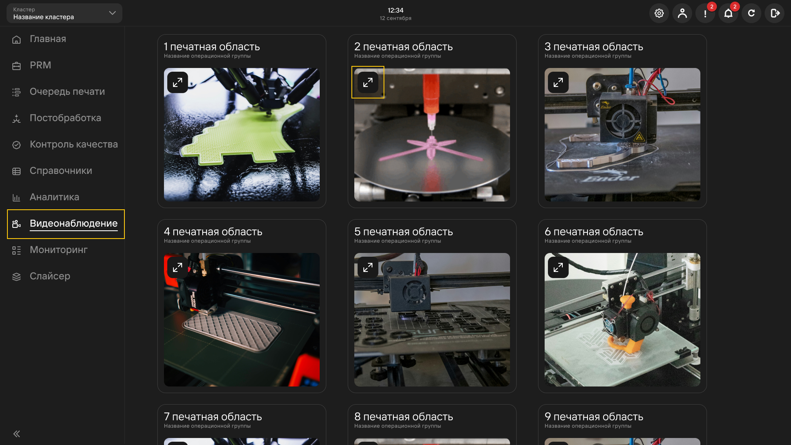
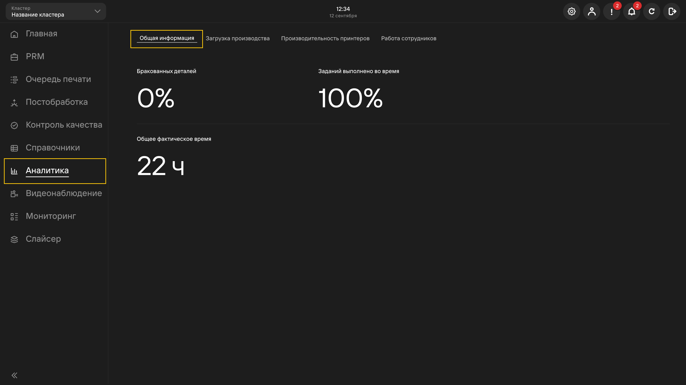
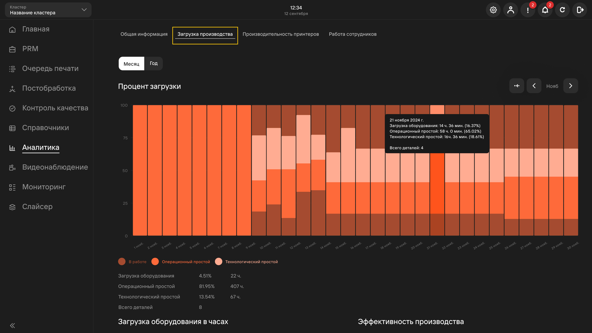
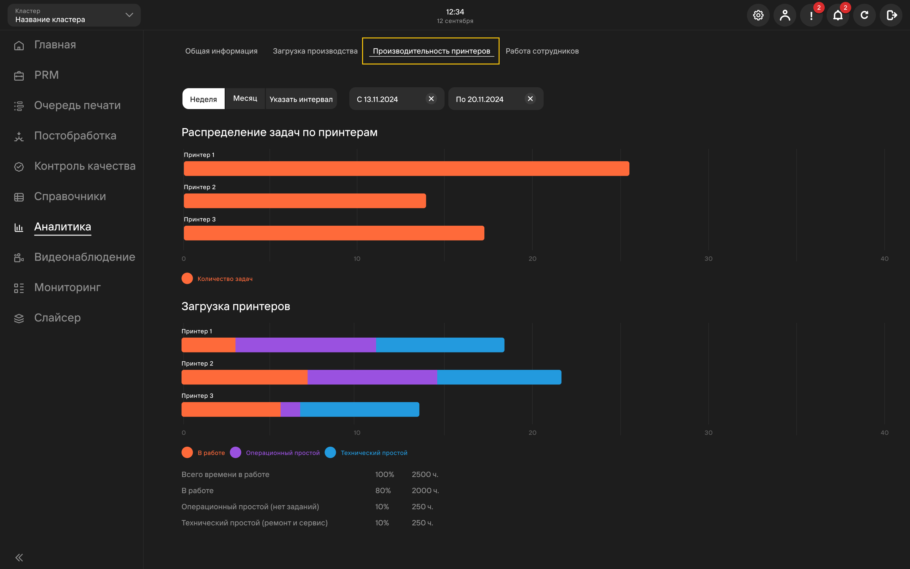
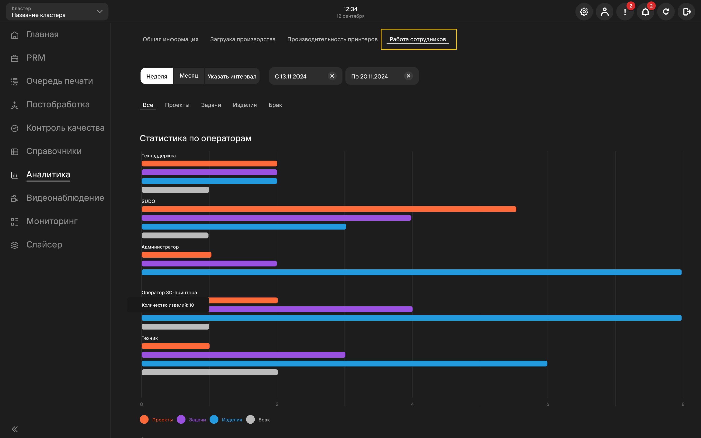

## Мониторинг

Вкладка **Мониторинг** отображает краткую информацию о принтерах в используемом кластере: статус, 
операционная группа, начало и окончание печати и др.

## Видеонаблюдение

Вкладка **Видеонаблюдение** отображает прямую трансляцию подключенных к принтеру видеокамер 
(подключение через [**настройки принтера в справочнике**](/docs/WorkingWithReferenceBooks#принтеры)).

При нажатии на кнопку **Расширить** возможен просмотр видео на полном экране.

## Аналитика 
### Общая информация 
Вкладка общей информации отражает краткую информацию по браку, выполненным вовремя заданиям\
и общему времени работы принтеров.

### Загрузка производства 
Вкладка **Загрузка производства** визуализирует данные о загруженности производства за выбранный период.

**Технологический простой** - связан с техническими аспектами оборудования и его работоспособностью.

:::tip Пример
      Оборудование остановилось для замены изношенного двигателя.
:::

**Операционный простой** - связан с организационными и операционными аспектами производственного процесса.

:::tip Пример
      Оборудование остановилось из-за отсутствия необходимых материалов для производства.
:::

### Производительность принтеров 
Вкладка **Производительность принтеров** выводит информацию о загрузке каждого принтера по отдельности за выбранный период времени.

### Работа сотрудников 
Вкладка **Работа сотрудников** отображает информацию о количестве изделий, проектов, задач и браков, выполненных\
за выбранный промежуток времени.

**Подстатьи**
- [**Работа со справочниками**](https://mes-docs.onrender.com/docs/WorkingWithReferenceBooks)
