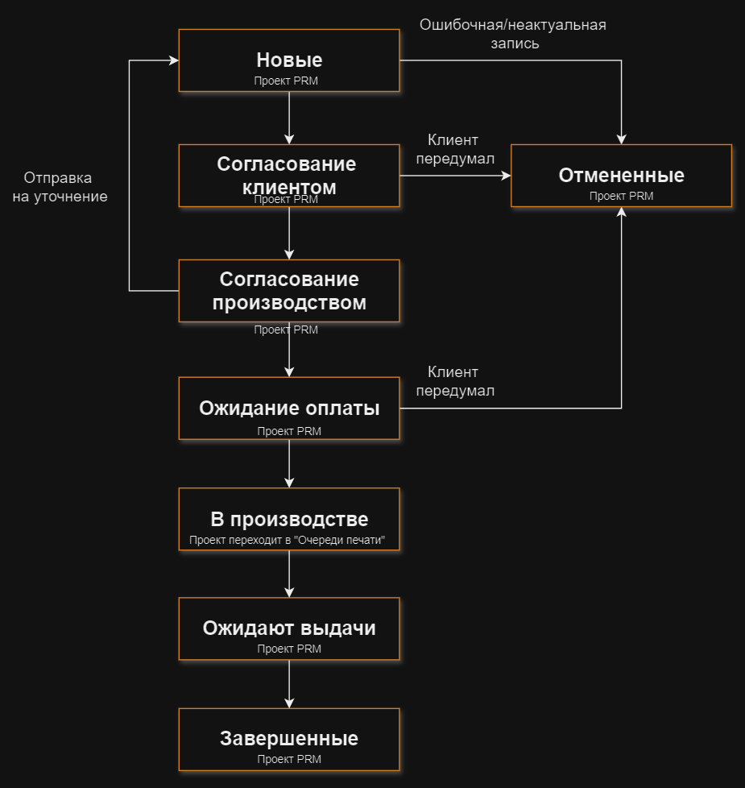
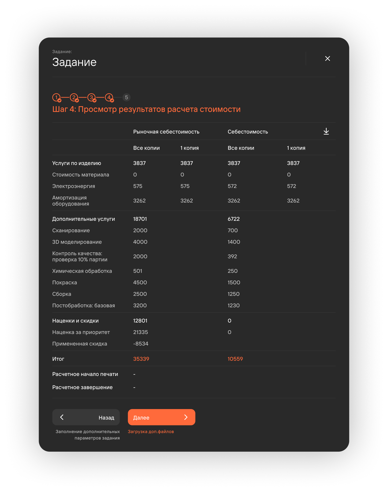

**PRM** (*Partner relationship management*) Система управления взаимоотношениями с партнерами — раздел, 
предназначенный для автоматизации взаимодействия с клиентами. Доступ к разделу имеют пользователи в соответствии 
с их [**ролевой моделью**](/docs/StartWithMES/RoleModel). 
Проекты (сделки), созданные через PRM, проходят расширенный жизненный цикл относительно проектов, созданных 
через [**очередь печати**](/docs/StartWithMES/PrintQueue/).

## Расширенный жизненный цикл

1. **Новые**\
   Пользователь с [**доступом к функционалу**](/docs/StartWithMES/RoleModel) 
   **Взаимодействие с разделом PRM** создает проект и задания.
2. **Отмененные**\
   При ошибочном создании проекта/отмены его клиентом пользователь может отменить его.
3. **Согласование клиентом**\
   Этап обсуждения с клиентом стоимости заказа, ожидаемых сроков и прочих деталей.
4. **Согласование производством**\
   Согласование проекта с **Начальником производства**.
5. **Ожидание оплаты**\
   Менеджер подтверждает прохождение данного статуса только после получения оплаты от клиента.
6. **В производстве**\
   Данный этап включает в себя весь жизненный цикл проекта, описанный в статье [**Жизненный цикл\
   и создание проекта**](/docs/StartWithMES/PrintQueue/LifeСycle#жизненный-цикл-проектов).
7. **Ожидают выдачи**\
   После завершения печати проекта, и опционального прохождения постобработки и контроля качества, 
   карточка проекта переходит в статус **Ожидают выдачи**. Менеджер подтверждает прохождение 
   данного статуса только после передачи товара клиенту.
8. **Завершенные**\
   Конец расширенного жизненного цикла.

## Расчет стоимости 

При создании задания через PRM менеджер может рассчитать фактическую и рыночную себестоимости задания.

1. **Услуги по изделию**
   - **Стоимость материала**\
      Динамически меняется от параметров: **объем пластика** и **материал**.
   - **Электроэнергия**\
      Динамически меняется от параметра **Расчетное время печати**.
   - **Химическая обработка**\
      Зависит от включенного/выключенной кнопки переключения на этапе заполнения доп. параметров. Стоимость фиксированная.
   - **Амортизация оборудования**\
      Зависит от времени печати, проставленного на этапе заполнения параметров печати.
   - **Покраска**\
      Динамически меняется от параметра **Покраска (все копии)**.
   - **Механическая обработка**\
      Динамически меняется от параметра **Механическая обработка (все копии)**.
   - **Сборка**\
      Динамически меняется от параметра **Сборка (все копии)**.
2. **Дополнительные услуги**
   - **Сканирование**
      Динамически меняется от параметра **Сканирование (все копии)**.      
   - **3D моделирование**\
      Динамически меняется от параметра **Моделирование**.
   - **Контроль качества: проверка**\
      Динамически меняется от вида проверки (10%/вся партия/первая копия).
3. **Наценки и скидки**
   - **Наценка за приоритет**\
      Зависит от срочности задания. Наценка проставляется только если задача срочная.\
   - **Примерная скидка**\
      Выставляется менеджером при заполнении доп. параметров задания.

Полученные расчеты можно выгрузить в excel-файл.

**Подстатьи**
- [**Ролевая модель**](https://mes-docs.onrender.com/docs/StartWithMES/RoleModel)
- [**Очередь печати**](https://mes-docs.onrender.com/docs/StartWithMES/PrintQueue/LifeСycle)