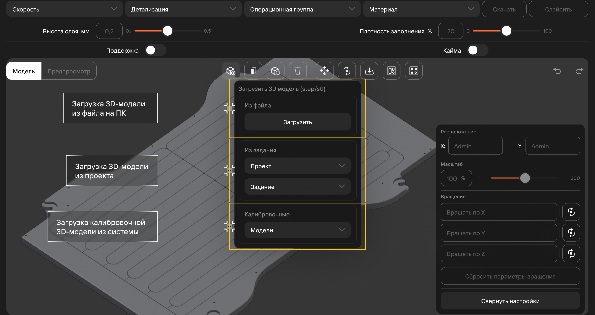
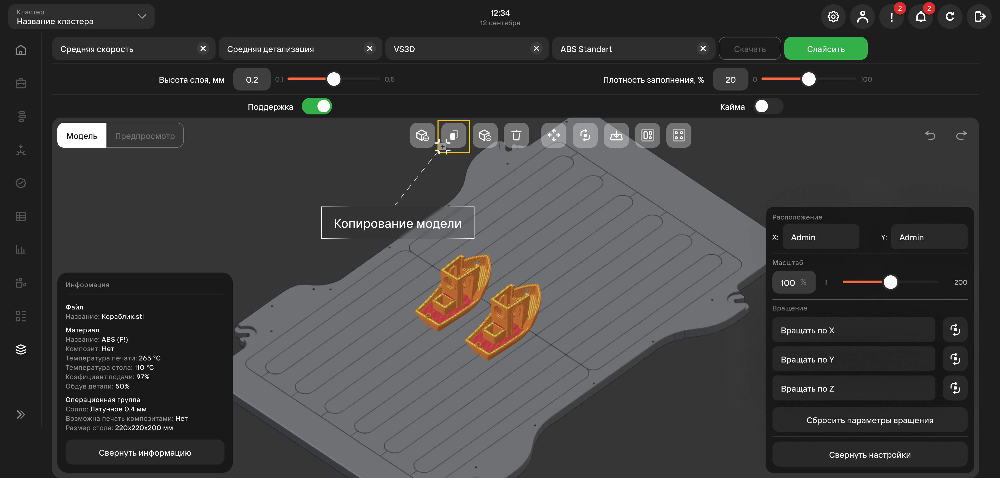
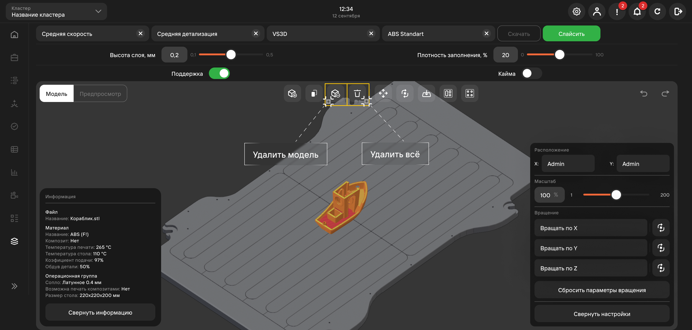
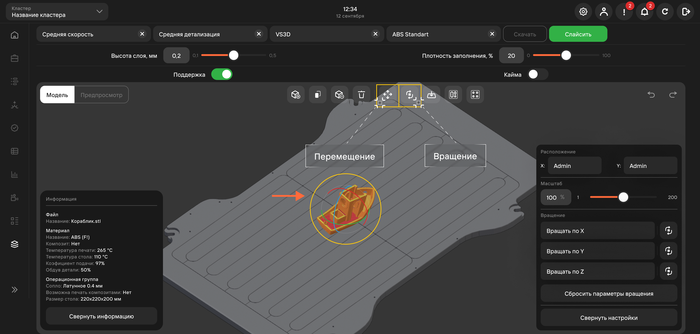
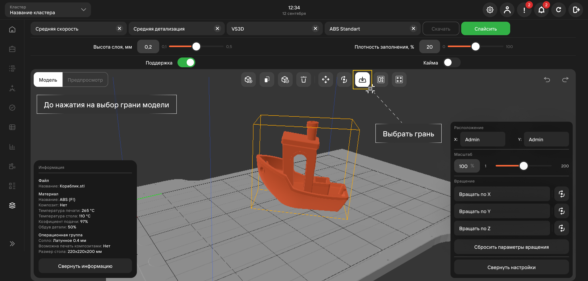
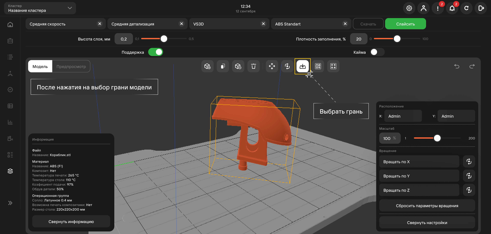
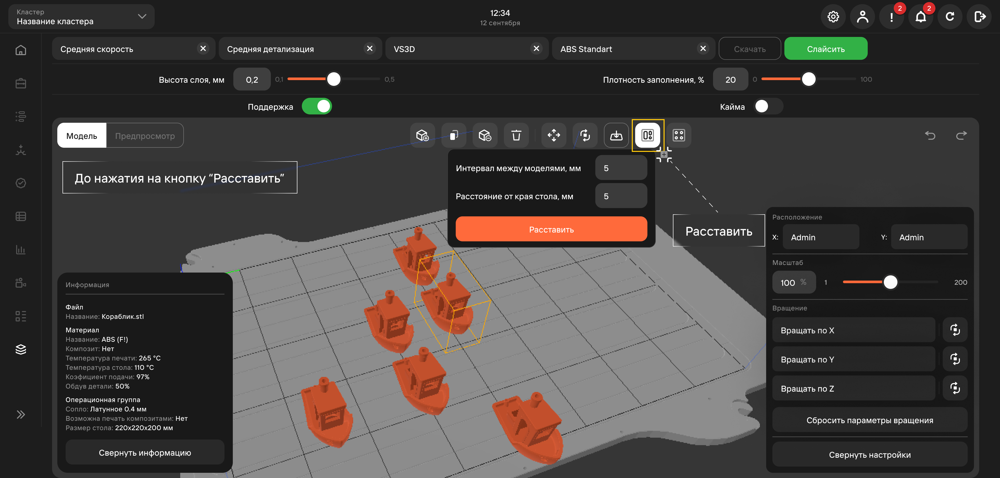
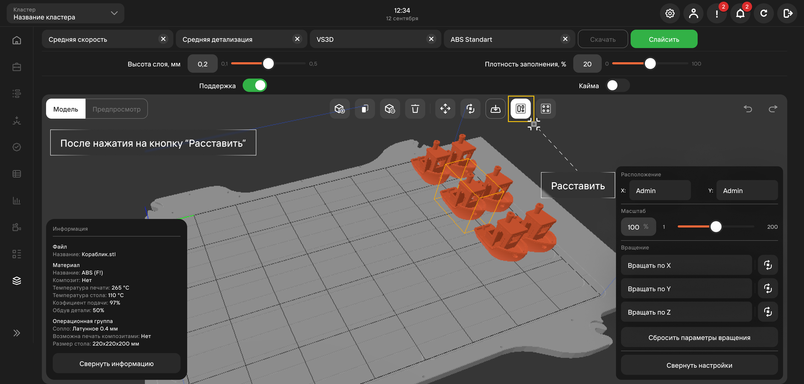
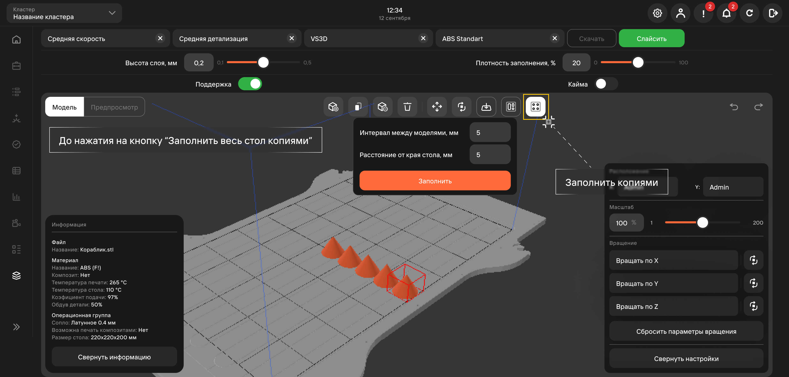
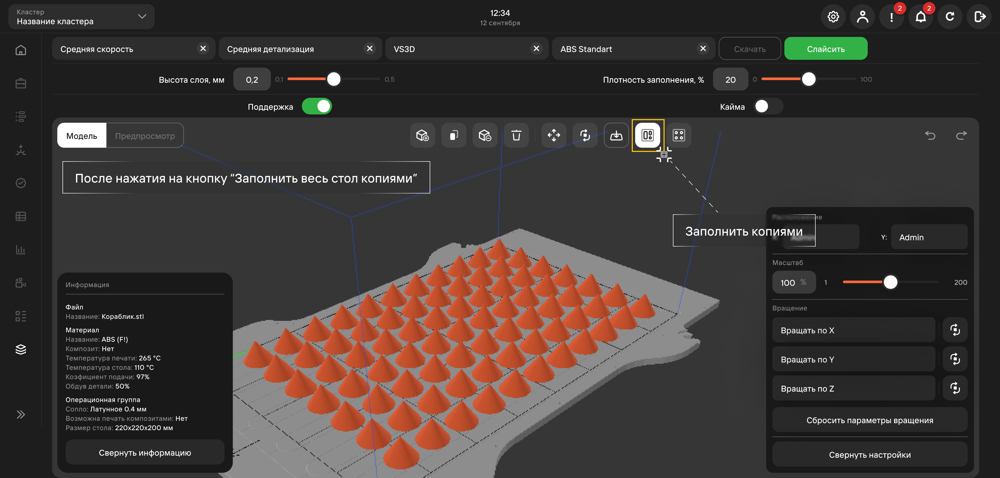

## Добавить модель 

Добавление 3D-модели в слайсер возможна 3-мя способами:

1. Через загрузку 3D-модели с персонального компьютера пользователя;
2. Через импорт 3D-модели из имеющихся проектов в MES-системе
3. Загрузка колибровочной модели (предустановленные простые модели для тестирования системы и принтеров).

## Дублировать модель 

Дублирование выбранной модели.

## Удалить модель и Удалить все

Первая кнопка позволяет удалить 1 выбранную модель, вторая - удаляет все модели на столе.

## Перемещение и вращение 

Отвечают за расположение модели на столе. Для изменения необходимо перемещать модель по выбранной оси.

## Выбрать грань 

Функция **Грань модели** переворачивает модель на выбранную грань.

## Расставить 

Функция **Расставить** позволяет сгруппировать все модели на столе. При запуске функции **Расставить** 
задается минимальный интервал между моделями и краями стола в миллиметрах.

После функции **Расставить** параметры вращения и масштаб, выставленные у моделей ранее, не изменяются.

## Заполнить весь стол копиями 

Заполняет стол максимальным количеством копий модели с учетом заполненных параметров.

