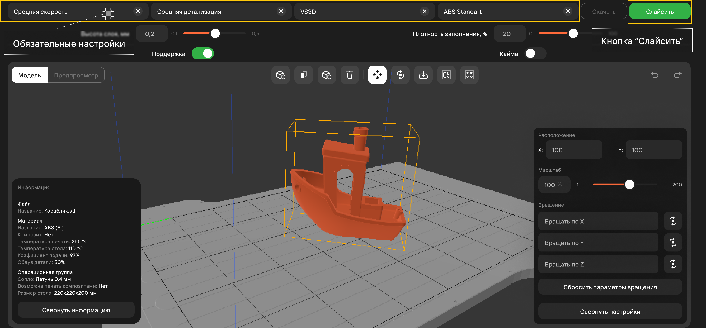
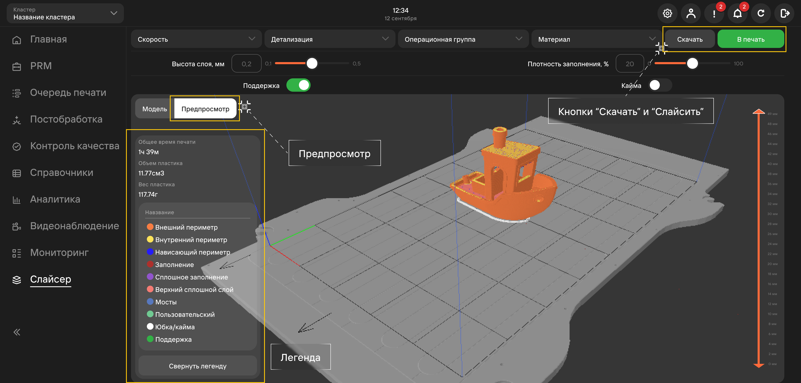
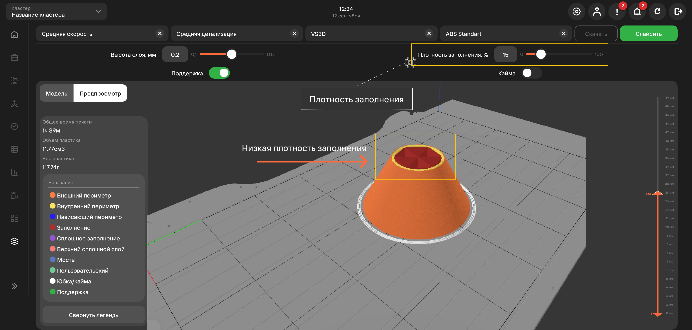

## Обязательные настройки

1. **Скорость печати**\
   Влияет на скорость, с которой принтер печатает объект, и может быть настроена для оптимизации 
   времени печати.
2. **Детализация**\
   Влияет на качество и детализацию печатного объекта, и может быть настроена для достижения 
   желаемого уровня детализации.
3. **Операционная группа**\
   Подробности работы описаны в [**статье об операционных группах**](/docs/StartWithMES/PrintQueue/PrintQueueRules/OperationalGroups) 
   и [**статье о справочниках**](/docs/StartWithMES/#запуск-печати).
4. **Материал**\
   Позволяет выбрать тип материала, используемого для печати.

:::caution ВНИМАНИЕ
      Без выбора указания обязательных настроек - кнопка **Слайсить** не будет доступна.
:::

## Слайсить/В печать/Скачать

Кнопка **Слайсить** создает gcode на основе загруженной 3D-модели и выбранных для нее настроек.

После создания gcode'а - слайсер открывает вкладку **Предпросмотр**. На месте кнопки **Слайсить** 
отображается кнопка **В печать**, при нажатии которой распечатывается модель 
(логика работы и условия аналогичны [**печати через терминал**](/docs/StartWithMES/#запуск-печати)).

После слайсинга модели - возможно скачать ее gcode на ПК пользователя, нажав кнопку **Скачать**.

## Легенда 

Окно **Легенда** отображает краткую информацию о модели и о цветовом обозначении филамента:

- **Внешний периметр** - обозначает внешний контур модели, который будет напечатан первым;
- **Внутренний периметр** - обозначает внутренний контур модели, который будет напечатан после 
внешнего периметра;
- **Нависающий периметр** - обозначает контур модели, который не имеет поддержки снизу и будет 
напечатан с помощью специальных настроек;
- **Заполнение** - обозначает внутреннюю часть модели, которая будет заполнена слоями филамента;
- **Сплошное заполнение** - обозначает внутреннюю часть модели, которая будет полностью заполнена 
слоями филамента без промежутков;
- **Верхний сплошной слой** - обозначает верхний слой модели, который будет напечатан сплошным 
слоем филамента;
- **Мосты** - обозначают участки модели, которые напечатаны над пустотой без поддержки;
- **Пользовательский** - обозначает дополнительный контур или область, которую пользователь 
может добавить в модель для специальных настроек печати;
- **Юбка/кайма** - обозначает контур вокруг модели, который будет напечатан перед печатью 
самой модели для обеспечения лучшей устойчивости;
- **Поддержка** - обозначает дополнительные структуры, которые будут напечатаны для поддержки 
нависающих частей модели.

## Дополнительные параметры

1. **Высота слоя**\
   Регулирует высоту слоя филамента. При уменьшении высоты слоя печать будет более детализированной\
   и точной, но при этом время печати увеличится. При увеличении высоты слоя печать будет быстрее,\
   но качество и детализация могут ухудшиться.
2. **Плотность заполнения**\
   Регулирует степень заполнения внутри детали (красный филамент).

**Подстатьи**
- [**Операционные группы**](https://mes-docs.onrender.com/docs/StartWithMES/PrintQueue/PrintQueueRules/OperationalGroups)
- [**Работа со справочниками**](https://mes-docs.onrender.com/docs/WorkingWithReferenceBooks)
- [**Начало работы с MES**](https://mes-docs.onrender.com/docs/StartWithMES/#запуск-печати)