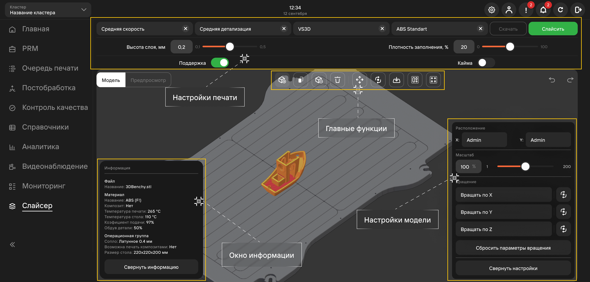

**Слайсер** - это программа, которая преобразует трехмерную модель в набор команд для 3D принтера.\
В MES-системе имеется встроенный слайсер, который позволяет подготовить файл для печати, 
настроив параметры печати, такие как скорость, температура, качество и другие.

Функционал вкладки слайсера разделен на 4 группы:

1. [Главные функции](https://mes-docs.onrender.com/docs/Slicer/MainSlicerFunctions);
2. [Настройки печати](https://mes-docs.onrender.com/docs/Slicer/SlicerPrintingSettings);
3. Настройки модели;
   Возможный функционал:
   - изменение расположения (координат) модели;
   - изменение масштаба модели;
   - настройка параметра вращения по выбранной оси;
   - сброс параметров вращения.
4. Окно информации.
   Отображает информацию о модели: название, температуру печати, операционную группу и прочее.

**Подстатьи**
- [Главные функции слайсера](https://mes-docs.onrender.com/docs/Slicer/MainSlicerFunctions)
- [Настройки печати слайсера](https://mes-docs.onrender.com/docs/Slicer/SlicerPrintingSettings)