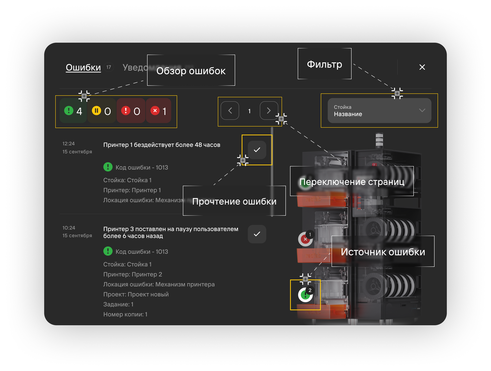
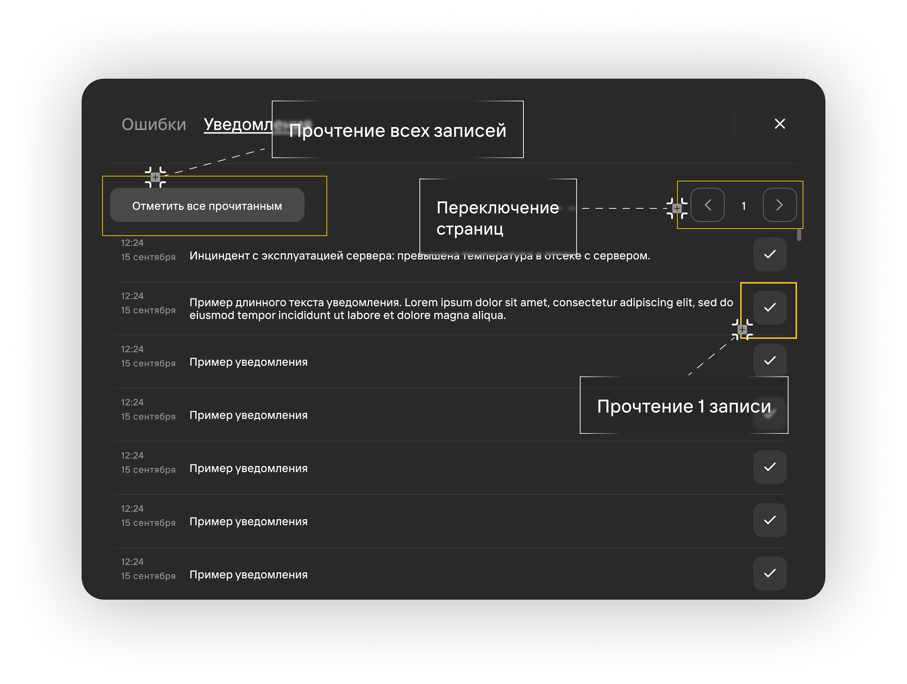
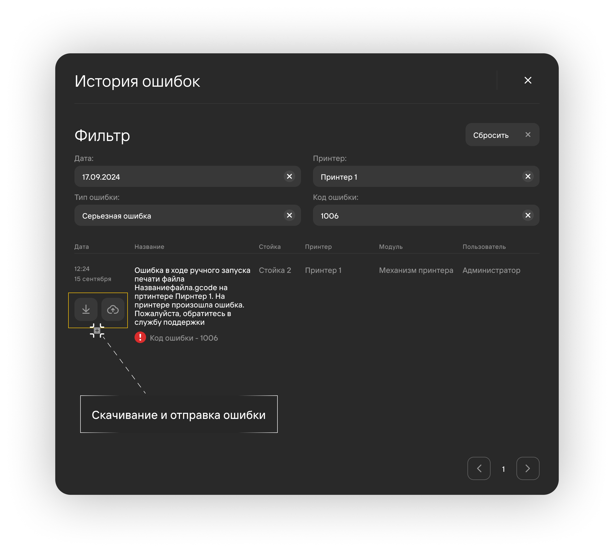
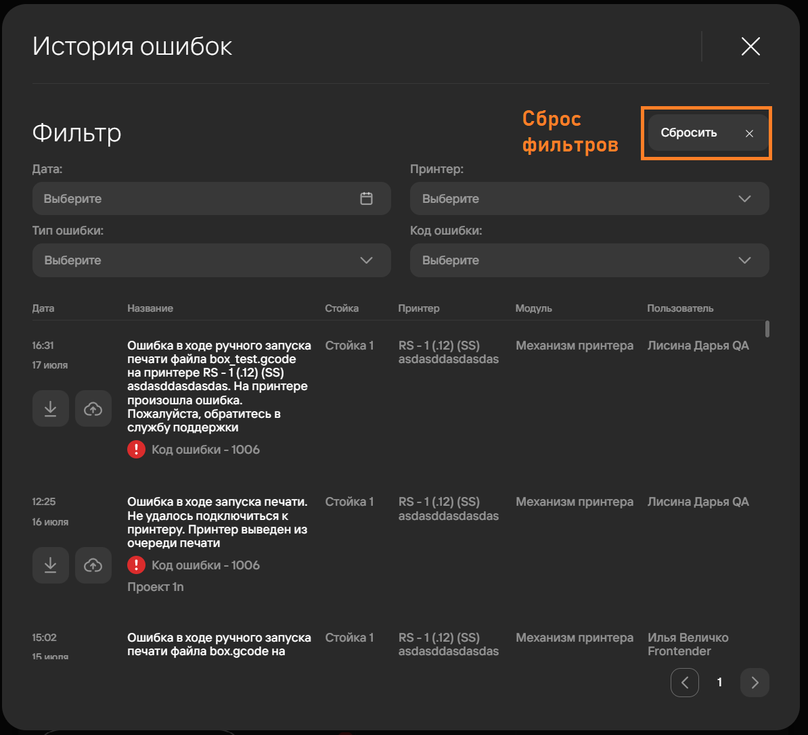

Окно уведомлений и ошибок можно открыть 2 способами:

- Через пункты **Уведомления** и **Ошибки** в [**верхнем меню**](/docs/StartWithMES/#главная-страница);
- Через раздел **Уведомления и ошибки** на главной странице системы.

## Ошибки 

Вкладка ошибок содержит следующие элементы:

1. Обзор ошибок по типам:
   - **Оповещение**\
      Ошибка, которая не приводит к [**статусу**](/docs/StartWithMES/PrinterArea#статусы-принтеров) 
      **Ошибка**, не приводит к браку детали, и в целом близка по важности к уведомлению.

      :::tip Пример
          Не работает датчик влажности.
      :::

   - **Предупреждение**\
      Ошибка, которая не приводит к [**статусу**](/docs/StartWithMES/PrinterArea#статусы-принтеров) 
      **Ошибка**, не приводит к браку детали, но может повлиять на качество печати или время печати.

      :::tip Пример
          Датчик температуры радиатора показывает перегрев, идет охлаждение, подождите.
      :::

   - **Серьезная ошибка**\
      Ошибка, которая приводит к [**статусу**](/docs/StartWithMES/PrinterArea#статусы-принтеров) 
      **Ошибка** и может привести к браку детали, если пользователь не сможет быстро устранить 
      причину ошибки.

      :::tip Пример
          Датчик температуры радиатора сломан. Принтер встал на паузу.
      :::

   - **Критическая ошибка**\
      Ошибка, которая приводит к отмене задания и по умолчанию приводит к браку текущей копии задания. 
      Принтер выводится из очереди печати до устранения неисправности.

      :::tip Пример
          Обрыв датчика температуры нагревателя основного экструдера. Текущая копия задания забракована, 
          принтер выведен из очереди печати, очередь проектов пересчитана. Идет охлаждение принтера. 
          Замените датчик температуры согласно инструкции или обратитесь\
          в техническую поддержку.
      :::

2. Фильтр по стойкам
3. Переключение страниц ошибок
4. Кнопка чтения ошибки
5. Источник ошибки\
   Значок ошибок появляется только при наличии ошибок у определенного источника.

## Уведомления

Вкладка уведомлений отображает любую информацию о взаимодействии с системой (перевод проектов, заданий и их 
копий в новые статусы, добавление пользователя, начало сервисной работы с принтером и прочее).

Содержит элементы:

1. Кнопка **Отметить все прочитанным**
2. Кнопка **Чтения уведомления**
3. **Переключение страниц** уведомлений

Подробнее о статусах проектов описано в статьях:

- [**Очередь печати**](/docs/StartWithMES/PrintQueue/#жизненный-цикл-проектов)
- [**PRM**](/docs/PRM)

## История ошибок 

Окно истории ошибок открывается через кнопку **История ошибок** на [**главной странице системы**](/docs/StartWithMES/#главная-страница).

История ошибок отображает все ошибки, закрытые пользователями.

При необходимости отчет об ошибке можно скачать или отправить в техническую поддержку для 
получения помощи в разрешении ошибки.

Для удобства поиска в истории ошибок встроен фильтр по следующим параметрам:

- Дата возникновения ошибки;
- Тип ошибки;
- Принтер (источник возникновения);
- Код ошибки.

Кнопка **Сбросить** очищает ранее настроенные фильтры и показывает список всех ошибок в истории.

**Подстатьи**
- [**Начало работы с MES**](https://mes-docs.onrender.com/docs/StartWithMES/)
- [**Область принтера**](https://mes-docs.onrender.com/docs/StartWithMES/PrinterArea)
- [**Очередь печати**](https://mes-docs.onrender.com/docs/StartWithMES/PrintQueue/)
- [**PRM**](https://mes-docs.onrender.com/docs/PRM)