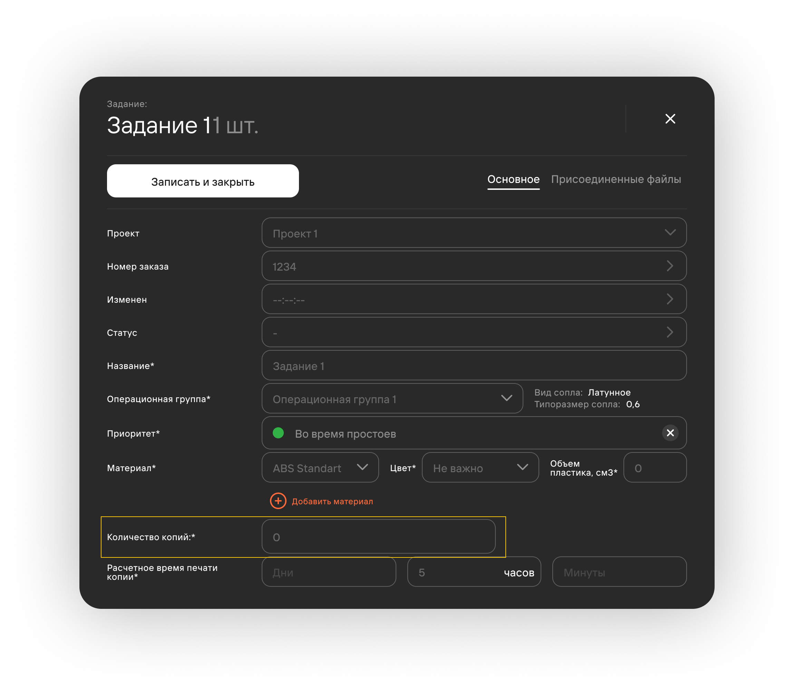

## Жизненный цикл проектов 

**Жизненный цикл проекта (ЖЦ)** - это время между началом и завершением проекта. ЖЦ проекта можно разделить на 3
ключевых этапа:
1. **Создание проекта**
2. **Печать задания**
3. **Постобработка и завершение проекта**

1. **В подготовке**\
   Пользователь с [**доступом к функционалу**](/docs/StartWithMES/RoleModel) 
   **Взаимодействие с разделом очередь печати** создает проект и задания.
2. **Удаление записи**\
   При ошибочном создании проекта инициатор может удалить его.
3. **На утверждении**\
   После создания и заполнения карточки проекта инициатор отправляет его на согласование инженерам.
   - При корректном заполнении карточки проекта инженер передает его на печать;
   - При отсутствии необходимой информации (и др. причине) инженер может отправить проект на 
   уточнение инициатору;
   - При неактуальности проекта инженер отменяет его. При отмене проекта все его задачи разделяются 
   на копии и переносятся на вкладку **История**. Отмененные копии подсвечиваются красным цветом.
4. **В печати**\
   При попадании проекта в очередь печати его задания разделяются на копии. С подробной информацией об очереди 
   печати можно ознакомиться в статье [**Правила формирования очереди печати**](/docs/StartWithMES/PrintQueue/PrintQueueRules/). 
5. **Отмененные**\
   Отмена печати возможна из статусов **На утверждении** и **В печати**. При переводе проекта в данный статус 
   все копии заданий этого проекта отменяются. Необходимое количество копий в карточке отмененных заданий обнуляется.

    

   - Конкретного задания проекта\
      Все копии выбранного задания отменяются. Необходимое количество копий в карточке отмененного задания обнуляется.
   - Конкретной копии задания\
      Необходимое количество копий в карточке задания уменьшается на 1 (поскольку отменили одну копию).
6. **Постобработка/ОТК**
   Нахождение проекта в данном статусе говорит о том, что на данный момент все 
7. **Завершенные**\
   В случае успешной печати всех копий заданий проект переходит в статус **Завершенные**.

## Жизненный цикл заданий

**Жизненный цикл проекта (ЖЦ)** - это время между началом и завершением проекта. Он состоит из 4 основных 
повторяющихся этапов: подготовки, утверждения, печати и завершения (архивации в историю).

## Жизненный цикл копий заданий

**Жизненный цикл проекта (ЖЦ)** - это время между началом и завершением проекта. Он состоит из 4 основных 
повторяющихся этапов: подготовки, утверждения, печати и завершения (архивации в историю).

**Подстатьи**
- [**Очередь печати**](https://mes-docs.onrender.com/docs/StartWithMES/PrintQueue/)
- [**Операционные группы**](https://mes-docs.onrender.com/docs/StartWithMES/PrintQueue/PrintQueueRules/OperationalGroups)
- [**Работа со слайсером**](https://mes-docs.onrender.com/docs/Slicer/)
- [**Ролевая модель**](https://mes-docs.onrender.com/docs/StartWithMES/RoleModel)
- [**Правила формирования очереди печати**](https://mes-docs.onrender.com/docs/StartWithMES/PrintQueue/PrintQueueRules/)