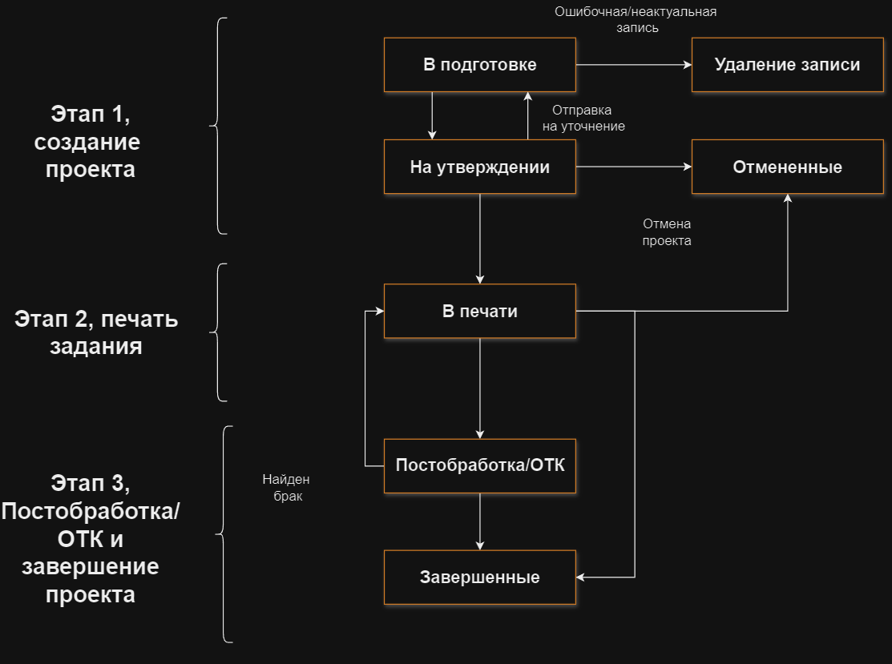
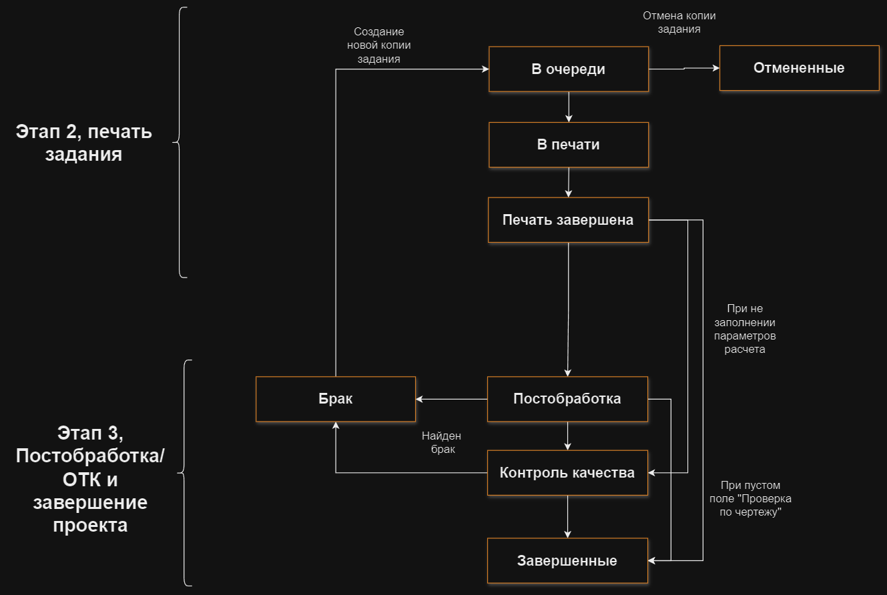

## Жизненный цикл проектов 

**Жизненный цикл (ЖЦ) проекта** - это время между началом и завершением проекта. ЖЦ проекта можно разделить на 3
ключевых этапа:
1. **Создание проекта**
2. **Печать задания**
3. **Постобработка/ОТК и завершение проекта**

1. **В подготовке**\
   Пользователь с [**доступом к функционалу**](/docs/StartWithMES/RoleModel) 
   **Взаимодействие с разделом очередь печати** создает проект и задания.
2. **Удаление записи**\
   При ошибочном создании проекта инициатор может удалить его.
3. **На утверждении**\
   После создания и заполнения карточки проекта инициатор отправляет его на согласование инженерам.
   - При корректном заполнении карточки проекта инженер передает его на печать;
   - При отсутствии необходимой информации (и др. причине) инженер может отправить проект на 
   уточнение инициатору;
   - При неактуальности проекта инженер отменяет его. При отмене проекта все его задачи разделяются 
   на копии и переносятся на вкладку **История**. Бракованные копии подсвечиваются красным цветом.
4. **В печати**\
   При попадании проекта в очередь печати его задания разделяются на копии. С подробной информацией об очереди 
   печати можно ознакомиться в статье [**Правила формирования очереди печати**](/docs/StartWithMES/PrintQueue/PrintQueueRules/). 
5. **Отмененные**\
   Отмена печати проекта возможна из статусов **На утверждении** и **В печати**. При переводе проекта в 
   данный статус все копии заданий этого проекта отменяются. Необходимое количество копий в карточке 
   отмененных заданий обнуляется.

    

   - Конкретной копии задания\
      Необходимое количество копий в карточке задания уменьшается на 1 (поскольку отменили одну копию).
6. **Постобработка/ОТК**\
   Данный статус проекта говорит о том, что одна или несколько копий заданий проекта находятся в статусе
   **Постобработка** или **Контроль качества**. 
7. **Завершенные**\
   После печати всех копий заданий и их проверки - проект переходит в статус **Завершенные**.

## Жизненный цикл заданий

**ЖЦ задания** начинается с этапа №2 - **печать задания**. 

    

1. **В очереди**\
   Как только проект переходит в стутус **В печати** - задание получает статус **В очереди**.
2. **Отмененные**
   - Отмена задания возможна только из статуса **В очереди** или **В печати**; 
   - Все копии выбранного задания также переводятся в статус **Отмененные**. Необходимое количество 
   копий в карточке отмененного задания обнуляется (аналогично отмене проекта).
3. **В печати**\
   В данном статусе происходит печать копии задания на принтере. Копия задания, которую печататют, также
   получает статус **В печати**.
4. **Завершенные**
   - После печати всех копий заданий - задание переходит в статус **Завершенные**; 
   - При наличии в партии брака, который может быть обнаружен в статусе **Постобработка** или 
   **Контроль качества** (статусы **копий заданий**) - задание возвращается обратно в статус **В печать**; 
   - Бракованной копии проекта присваивается статус **Брак** и создается новая копия проекта в статусе 
   **В очереди** (см. **ЖЦ копий заданий**).

## Жизненный цикл копий заданий

**ЖЦ копий заданий** начинается с этапа №2 - **печать задания** (аналогично **ЖЦ задания**).

    

1. **В очереди**\
   Как только задание переходит в стутус **В очереди** - все его копии получают аналогичный 
   статус (**В очереди**).
2. **Отмененные**\
   Отмена копии задания возможна только из статуса **В очереди**. Необходимое количество копий в карточке 
   задания уменьшается на 1 (поскольку отменили одну копию).
3. **В печати**\
   Пока задание находится в статусе **В печати** - его копии поочередно переходят из статуса **В очереди**
   в статус **В печати**. В данном статусе происходит печать копии задания на принтере.
4. **Постобработка**
   - После печати копия задания переходит в статус **Постобработка**; 
   - В случае брака 3D-модели - копии задания присваивается статус **Брак** и создается новая копия 
   задания, которой присваивается статус **В очереди**; 
   - При незаполнении параметров постобработки - копия может отправиться на **Контроль качества** или стать 
   **Завершенной**.
5. **Брак**\
   Распечатанная 3D-модель не прошла проверку.
6. **Контроль качества**
   - После постобработки копия задания переходит в статус **Контроль качества**; 
   - В случае брака 3D-модели - копии задания присваивается статус **Брак** и создается новая копия 
   задания, которой присваивается статус **В очереди**; 
   - При пустом поле **Проверка по чертежу** копия задания переходит сразу в статус **Заверешнные**.
7. **Завершенные**\
   После печати, постобработки и контролю качетсва (при необходимости) копия задания получает статус - 
   **Завершенные**.

**Подстатьи**
- [**Ролевая модель**](https://mes-docs.onrender.com/docs/StartWithMES/RoleModel)
- [**Правила формирования очереди печати**](https://mes-docs.onrender.com/docs/StartWithMES/PrintQueue/PrintQueueRules/)