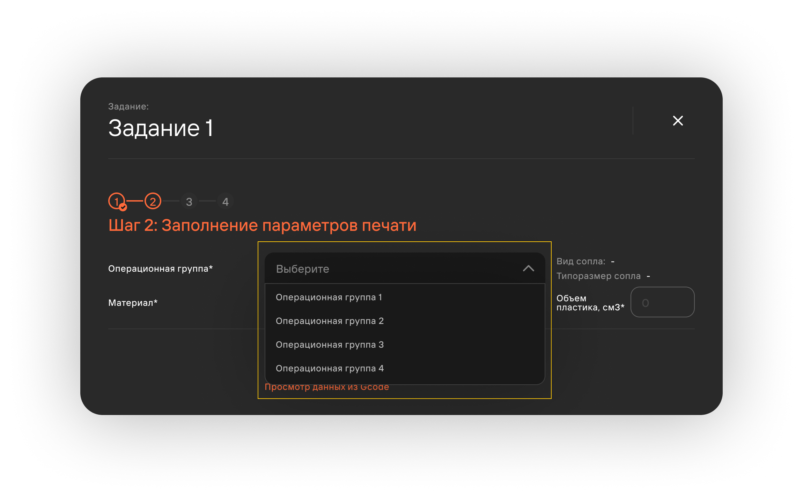
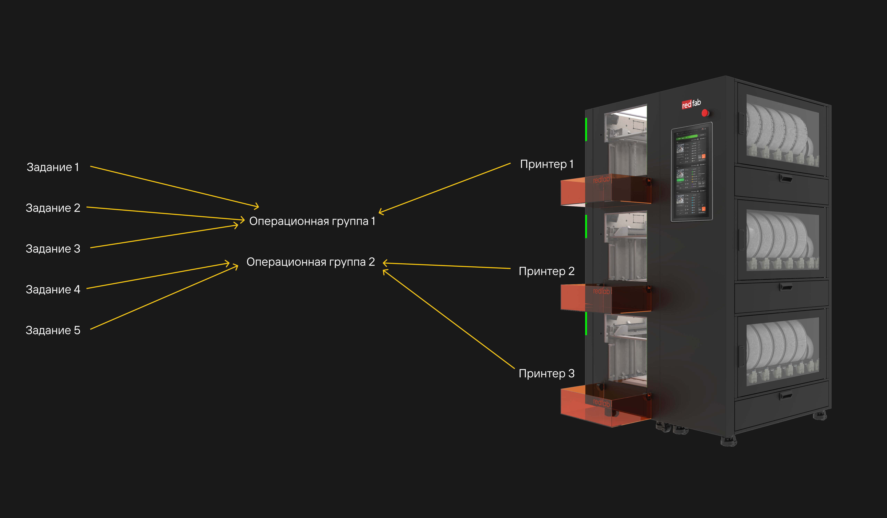

Операционные группы связывают задания и принтеры.

Задание назначается операционной группе (далее ОГ), выбранной при заполнении карточки задания. 
Далее - копии задачи встают в очередь **только** на принтеры, находящиеся под выбранной ОГ.

Принтеры, находящиеся в одной операционной группе, обеспечиваются одинаковыми параметрами сопел 
(материалом и типоразмером).

Принтер всегда находится строго в одной ОГ. Пользователь может самостоятельно объединить принтеры 
по любому принципу.

:::tip Примеры
      - Имеется 5 заданий с операционной группой **Титан 0.8**. Под данной ОГ находится 2 принтера. 
      Пользователь заводит 6 задачу с данной ОГ. Копии созданной задачи встанут в очередь ОГ **Титан 0.8**.
      - В распоряжении имеются только принтера с ОГ **Титан 0.8** и **Латунь 0.4**. Поступила задание 
      с операционной группой **Тест**. В таком случае печать не будет воспроизведена и копии задания 
      "зависнут" в очереди, поскольку подходящей ОГ не существует.
:::
