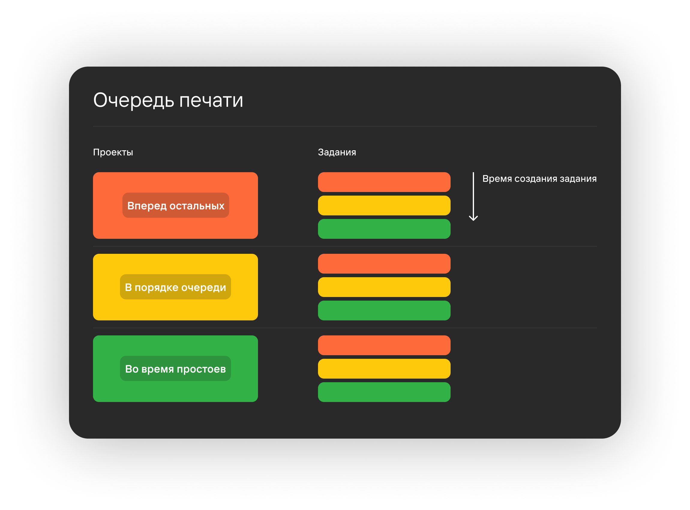

Каждая копия задания в проекте является отдельным экземпляром, который помещается в очередь печати.

:::tip Пример
      В проекте есть 2 задания: "А" и "Б".\
      В задании "А" необходимо распечатать **5 копий** модели.\
      В задании "Б" необходимо **10 копий** модели.\
      Всего из данных заданий будет создано **15 копий** экземпляров.
:::

**Копии сортируются по:**

1. Приоритету проектов
2. Времени создания проектов
3. Приоритету заданий
4. Времени создания задания

Таким образом, сперва будут напечатаны все копии заданий с высоким приоритетом, затем со средним, 
в последнюю очередь - с низким.

Внутри этих проектов копии сортируются по приоритету заданий: у проектов с высоким приоритетом среди 
всех его копий заданий сперва будут печататься задания с высоким приоритетом и так далее. 
Среди равных приоритетов порядок определяется временем создания. Сперва те, что были созданы раньше.

:::caution Внимание
      Задания назначаются не на принтер, а на [операционную группу](https://yt.omegafuture.ru/articles/RedFabMES-A-783/%D0%9E%D0%BF%D0%B5%D1%80%D0%B0%D1%86%D0%B8%D0%BE%D0%BD%D0%BD%D1%8B%D0%B5-%D0%B3%D1%80%D1%83%D0%BF%D0%BF%D1%8B)!
:::

**Отсортированный список копий распределяется между доступными принтерами, а именно:**

- Принтер в сети;
- Принтер включен в очередь печати;
- Принтер не в ошибке, не в сервисной операции;
- У принтера такая же операционная граппа, как у задания;
- В принтер загружены требуемые материалы.

**На принтере начнется автоматическая печать, если:**

- На главной у принтера отображается "Готов к работе" (если указаны другие состояния - необходимо их изменить);
- При выбранном конвейерном столе вся периферия (вакуумная система, система протяжки, двери) не в ошибке;
- При стеклянном столе в любом случае.