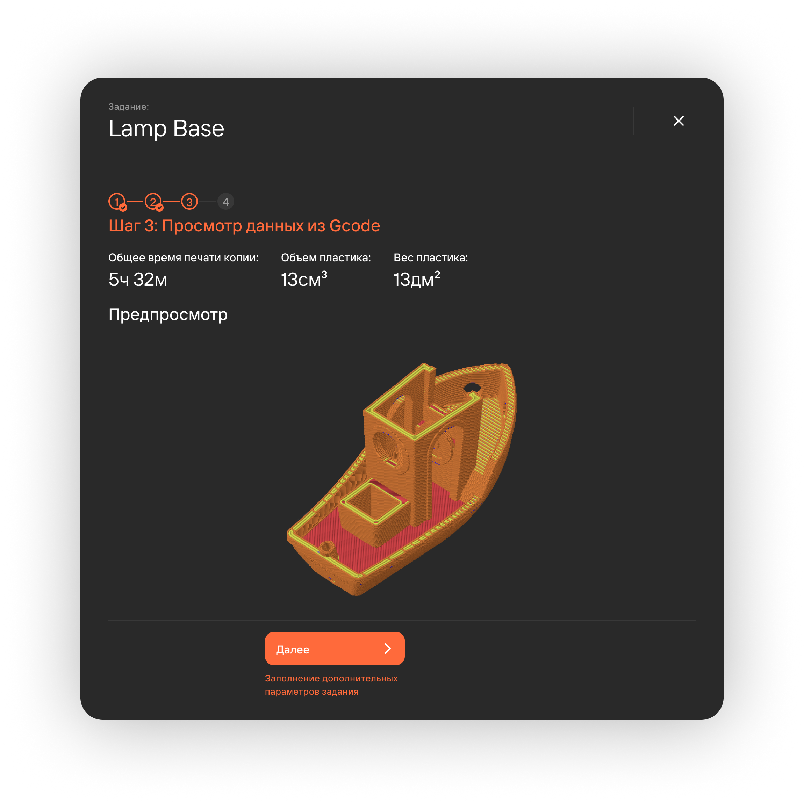

## Проекты

В разделе **Очередь печати** создаются проекты клиентов. У одного клиента может быть один или 
несколько проектов, а в каждом проекте может быть одно или несколько [заданий](https://mes-docs.onrender.com/docs/StartWithMES/PrintQueue/#задания).

Для создания проекта необходимо перейти на вкладку **Очередь печати** и нажать на 
кнопку **Создать проект+**:

- Проект необходим для объединения заданий в одну сущность;
- 1 Проект = 1 Заказ клиента;
- Проекту выставляется приоритет, который влияет на его порядок в очереди печати;
- Система уведомляет о рисках просрочки через уведомления и диаграмму Ганта.

## Задания 

После сохранения проекта необходимо создать для него не менее 1 задания через кнопку **Создать задание+** 
на вкладке **Задания проекта**:

- Задание - конкретный файл c параметрами, который нужно напечатать;
- Загруженный файл может быть напечатан в системе в нужном кол-ве копий;
- Назначается на печать конкретной [операционной группе](https://mes-docs.onrender.com/docs/StartWithMES/PrintQueue/PrintQueueRules/OperationalGroups);
- Приоритет влияет на порядок печати в рамках своего проекта.

Задания проекта возможно создать 3 способами:

- На основе своего Gcode;
- На основе 3D модели;
- Без файла.

### На основе своего Gcode 

1. **Создание задания**
   - Модель распечатается на основе прикрепленного gcode'а;
   - Указывается приоритет задания;
   - Задается необходимое количество копий.

2. **Заполнение параметров печати**
   - Подобрее об операционных группах;
   - Объем пластика используется для расчета стоимости задания;
   - Объем пластика в gcode прописан, задавать вручную не надо.

3. **Просмотр данных из Gcode**
   - Представление краткой информации о печати;
   - Просмотр модели в [**слайсере**](https://mes-docs.onrender.com/docs/Slicer/).

4. **Загрузка дополнительных файлов**

### На основе 3D модели 

1. **Создание задания**\
   Аналогично примеру с gcode'ом, но теперь загружается 3D модель.
2. **Заполнение параметров печати**\
   Аналогично примеру с gcode'ом.
3. **Заполнение параметров слайсера**
   - Отображение 3D модели в **слайсере**;
   - Возможность изменения настроек [**слайсера**](https://mes-docs.onrender.com/docs/Slicer/).

4. **Просмотр результатов слайсинга**\
   Аналогично примеру с gcode'ом.
5. **Загрузка дополнительных файлов**\
   Аналогично примеру с gcode'ом, gcode формируется из загруженной 3D модели, следовательно загружать его не надо.

### Без файла 

1. **Создание задания**\
   Аналогично примеру с gcode'ом, но без прикрепления файлов.
2. **Заполнение параметров печати**\
   Из-за отсутствия файлов печати необходимо заполнение информации о расчетном времени печати и объеме пластика.

3. **Загрузка дополнительных файлов**\
   Аналогично примеру с gcode'ом.

## Проверка возможности печати

На вкладке **Проверка возможности печати** система отображает информацию о невыполненных условиях для печати заданий. Проверяются:

- Наличие принтеров в указанной оперативной группе;
- Наличие проекта в очереди печати;
- Наличие необходимых материалов и цветов в принтере для печати задания.

## Жизненный цикл проектов 

**Жизненный цикл проекта (ЖЦ)** - это время между началом и завершением проекта. Он состоит из 4 основных 
повторяющихся этапов: подготовки, утверждения, печати и завершения (архивации в историю).

1. **В подготовке**\
   Пользователь с [доступом к функционалу](https://mes-docs.onrender.com/docs/StartWithMES/RoleModel) 
   **Взаимодействие с разделом очередь печати** создает проект и задания.
2. **Удаление записи**\
   При ошибочном создании проекта инициатор может удалить его.
3. **На утверждении**\
   После создания и заполнения карточки проекта инициатор отправляет его на согласование инженерам.
   - При корректном заполнении карточки проекта инженер передает его на печать;
   - При отсутствии необходимой информации (и др. причине) инженер может отправить проект на 
   уточнение инициатору;
   - При неактуальности проекта инженер отменяет его. При отмене проекта все его задачи разделяются 
   на копии и переносятся на вкладку **История**. Отмененные копии подсвечиваются красным цветом.
4. **В печати**\
   При попадании проекта в очередь печати его задания разделяются на копии. С подробной информацией об очереди 
   печати можно ознакомиться в статье [**Правила формирования очереди печати**](https://mes-docs.onrender.com/docs/StartWithMES/PrintQueue/PrintQueueRules/). 
   В данном статусе возможны следующие варианты отмены печати:
   - Всего проекта\
      Все копии заданий проекта отменяются. Необходимое количество копий в карточке отмененных заданий обнуляется.

    

   - Конкретного задания проекта\
      Все копии выбранного задания отменяются. Необходимое количество копий в карточке отмененного задания обнуляется.
   - Конкретной копии задания\
      Необходимое количество копий в карточке задания уменьшается на 1 (поскольку отменили одну копию).
5. **История**\
   Отображение всех копий заданий, которые прошли этап утверждения (были распечатаны или отменены).

**Подстатьи**
- [Очередь печати](https://mes-docs.onrender.com/docs/StartWithMES/PrintQueue/)
- [Операционные группы](https://mes-docs.onrender.com/docs/StartWithMES/PrintQueue/PrintQueueRules/OperationalGroups)
- [Работа со слайсером](https://mes-docs.onrender.com/docs/Slicer/)
- [Ролевая модель](https://mes-docs.onrender.com/docs/StartWithMES/RoleModel)
- [Правила формирования очереди печати](https://mes-docs.onrender.com/docs/StartWithMES/PrintQueue/PrintQueueRules/)