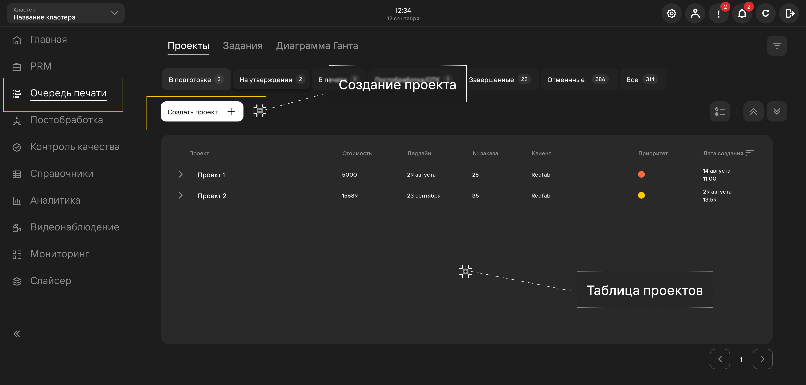

## Проекты

В разделе **Очередь печати** создаются проекты клиентов. У одного клиента может быть один или 
несколько проектов, а в каждом проекте может быть одно или несколько [**заданий**](/docs/StartWithMES/PrintQueue/#задания).

Для создания проекта необходимо перейти на вкладку **Очередь печати** и нажать на 
кнопку **Создать проект+**:

- Проект необходим для объединения заданий в одну сущность;
- 1 Проект = 1 Заказ клиента;
- Проекту выставляется приоритет, который влияет на его порядок в очереди печати;
- Система уведомляет о рисках невыполнения проектов в срок через уведомления и диаграмму Ганта.

## Задания 

После сохранения проекта необходимо создать для него не менее 1 задания через кнопку **Создать задание+** 
на вкладке **Задания проекта**:

- Задание - конкретный файл c параметрами, который нужно напечатать;
- Загруженный файл может быть напечатан в системе в нужном кол-ве копий;
- Назначается на печать конкретной [**операционной группе**](/docs/StartWithMES/PrintQueue/PrintQueueRules/OperationalGroups);
- Приоритет влияет на порядок печати в рамках своего проекта.

Задания проекта возможно создать 3 способами:

- На основе своего Gcode;
- На основе 3D модели;
- Без файла.

### На основе своего Gcode 

1. **Создание задания**
   - Модель распечатается на основе прикрепленного gcode'а;
   - Указывается приоритет задания;
   - Задается необходимое количество копий.

2. **Заполнение параметров печати**
   - Подробнее об [операционных группах](/docs/StartWithMES/PrintQueue/PrintQueueRules/OperationalGroups);
   - Объем пластика используется для расчета стоимости задания;
   - Объем пластика в gcode прописан, задавать вручную не надо.

3. **Просмотр данных из Gcode**
   - Представление краткой информации о печати;
   - Просмотр модели в [**слайсере**](/docs/Slicer/).

4. **Загрузка дополнительных файлов**

### На основе 3D модели 

1. **Создание задания**\
   Аналогично примеру с gcode'ом, но теперь загружается 3D модель.
2. **Заполнение параметров печати**\
   Аналогично примеру с gcode'ом.
3. **Заполнение параметров слайсера**
   - Отображение 3D модели в **слайсере**;
   - Возможность изменения настроек [**слайсера**](/docs/Slicer/).

4. **Просмотр результатов слайсинга**\
   Аналогично примеру с gcode'ом.
5. **Загрузка дополнительных файлов**\
   Аналогично примеру с gcode'ом, gcode формируется из загруженной 3D модели, следовательно загружать его не надо.

### Без файла 

1. **Создание задания**\
   Аналогично примеру с gcode'ом, но без прикрепления файлов.
2. **Заполнение параметров печати**\
   Из-за отсутствия файлов печати необходимо заполнение информации о расчетном времени печати и объеме пластика.

3. **Загрузка дополнительных файлов**\
   Аналогично примеру с gcode'ом.

## Проверка возможности печати

На вкладке **Проверка возможности печати** система отображает информацию о невыполненных условиях для 
печати заданий. Проверяются:

- Наличие принтеров в указанной операционной группе;
- Наличие пропринтера в очереди печати;
- Наличие необходимых материалов и цветов в принтере для печати задания.

**Подстатьи**
- [**Очередь печати**](https://mes-docs.onrender.com/docs/StartWithMES/PrintQueue/)
- [**Операционные группы**](https://mes-docs.onrender.com/docs/StartWithMES/PrintQueue/PrintQueueRules/OperationalGroups)
- [**Работа со слайсером**](https://mes-docs.onrender.com/docs/Slicer/)