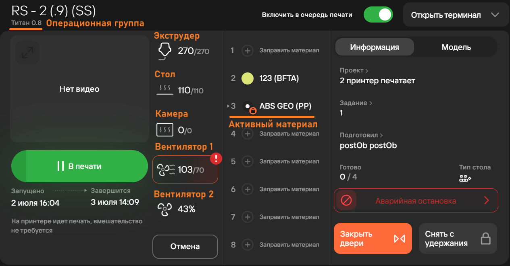

Область принтера отображает основную информацию об устройстве и позволяет удаленно управлять ими. 
Область включает в себя следующие элементы:

- [**Операционная группа**](/docs/StartWithMES/PrintQueue/PrintQueueRules/OperationalGroups) принтера
- Окно для видео
- Кнопка-статус
- Кнопка отмены печати
- Информацию о комплектующих:
  - Температура экструдера
  - Температура стола печати
  - Температура камеры
  - Температура вентилятора 1
  - Мощность вентилятора 2
- Используемые материалы
- Информация о принтере
- Быстрый просмотр модели
- Кнопка аварийной остановки
- Кнопка закрытия двери
- Кнопка снятия с удержания

## Статусы принтеров 

**Нет данных**\
\
Отсутствует связь с принтером.

**Сервисная операция**\
\
На принтере запущена сервисная операция. В данный момент использование принтера невозможно.

**Подготовка к печати**\
\
Проверяется работоспособность принтера и периферии. Скачивается файл.

**Завершение печати**\
\
Статус присваивается после завершения печати. Производится открытие дверей, отпускание вакуума, протяжка.

**Нет заданий**\
\
Принтер свободен и готов печатать

**Ошибка**\
\
Принтер выпал в ошибку. Если ошибка не исправится в течении нескольких минут - рекомендуется нажать\
на кнопку. После нажатия на **Ошибка** система сделает попытку сброса ошибки без перезагрузки принтера.\
В случае неудачи - система принудительно перезагрузит принтер.

**Завершить вручную**\
\
На принтере установлен стол без протяжки и для завершения печати необходимо вмешательство оператора. Нажатие на кнопку уведомит систему, что на принтер можно отправлять новое задание.

**Сброс брака**\
\
Копия, которая печатается на принтере, была отменена и считается браком. Нажатие на кнопку уведомит систему, что на принтер можно отправлять новое задание. При браке создается новая копия задания.

**В печати**\
\
Принтер печатает. Прогресс бар отображает процесс печати. Нажатие поставит печать на паузу.

**Продолжить**\
\
Принтер на паузе. Нажатие продолжит остановленную печать.

**Подстатьи**
- [**Операционные группы**](https://mes-docs.onrender.com/docs/StartWithMES/PrintQueue/PrintQueueRules/OperationalGroups)
