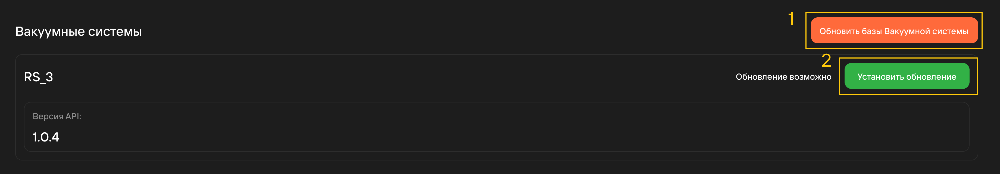

Переход в центр обновлений осуществляется с помощью нажатия на кнопку **Перейти в центр обновлений** 
в [**разделе настроек**](/docs/StartWithMES/#настройки).

## Обновление системы 

Обновления МЕS-системы делятся на 4 раздела. Для обновления каждого из разделов необходимо 
загружать отдельный файл:

- **Серверная часть приложения**\
  Отвечает за обработку запросов клиента и выполнение запрошенных операций.\
  Файл обновления - backend.zip
- **Клиентская часть приложения**\
  Отвечает за запрос информации у серверной части приложения.\
  Файл обновления - frontend-docker.zip
- **Слайсер**\
  Отвечает за преобразование трехмерной модели в набор команд для 3D-принтера.\
  Файл обновления - slicer.zip.
- **Центр обновлений**\
  Отвечает за проверку и установку обновлений в систему.\
  Файл обновления - update\_manager.zip

Для загрузки обновления необходимо:

1. Загрузить архив обновления через кнопку **Установить обновление**;

    

2. Перезагрузить страницу.\
  Для перезагрузки клиента (страницы) на стойке необходимо нажать на тачскрине **кнопку перезагрузки**:
    
    

:::caution Внимание
      При обновлении серверной части всегда необходимо обновить и клиентскую (и наоборот). 
      Загрузка лишь 1 из частей может привести к нарушению работы системы и потере данных.
:::

## Обновление принтеров

Обновление принтеров происходит в 2 этапа:

1. Обновление базы данных через загрузку архива обновления для выбранного раздела\
   Аналогично обновлениям MES-системы, обновления принтеров делятся на 4 раздела:
   - **Базы API**\
      Отвечает за предоставление интерфейса для взаимодействия с принтером через сеть.\
      Файл обновления - printer\_api.zip
   - **Базы Klipper**\
      Отвечает за управление принтером с помощью программного обеспечения **Klipper**.\
      Файл обновления - klipper.zip
   - **Базы селективной системы**\
      Отвечает за управление системой, которая выбирает и подает нужный материал для печати\
      в принтере.\
      Файл обновления - filament\_system.zip
   - **Базы телеметрии**\
      Отвечает за сбор и отображение информации о работе принтера (температура, скорость печати\
      и прочие).\
      Файл обновления - telemetry.zip
2. Обновление каждого принтера отдельно через кнопку **Установить обновление**.

:::caution Внимание
      Для обновления принтеров необходимо чтобы:
      - принтер находился в простое;
      - принтер не был включен в [**очередь печати (п.3)**](/docs/StartWithMES/#главная-страница).
:::

В случае несоблюдения условий будет отображаться предупреждающая информация:

Если принтер готов к обновлению - отобразится соответствующая информация и загорится кнопка обновления:

## Обновление вакуумной системы 

Обновление вакуумной системы происходит в 2 этапа:

1. Обновление базы данных через загрузку архива обновления;
2. Централизованное обновление вакуумной системы на всех принтерах.

:::caution Внимание
      Для обновления вакуумной системы необходимо чтобы:
      - все принтеры были в простое;
      - все принтеры не были включены в [**очереди печати (п.3)**](/docs/StartWithMES/#главная-страница);
      - на всех принтерах должна быть выключена вакуумная система.
:::

В случае несоблюдения условий будет отображаться предупреждающая информация:

**Подстатьи**
- [**Начало работы с MES**](https://mes-docs.onrender.com/docs/StartWithMES/)
- [**Правила формирования очереди печати**](https://mes-docs.onrender.com/docs/StartWithMES/PrintQueue/PrintQueueRules/)
