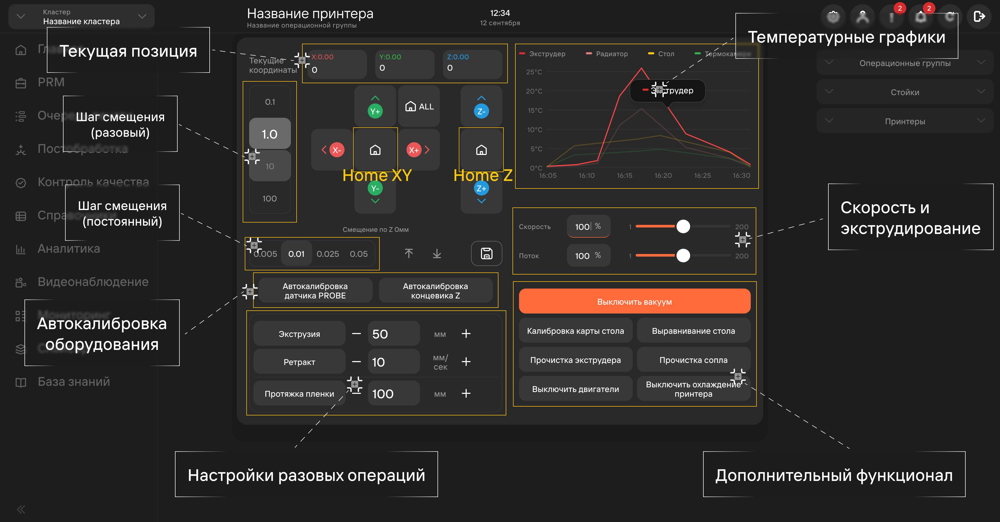
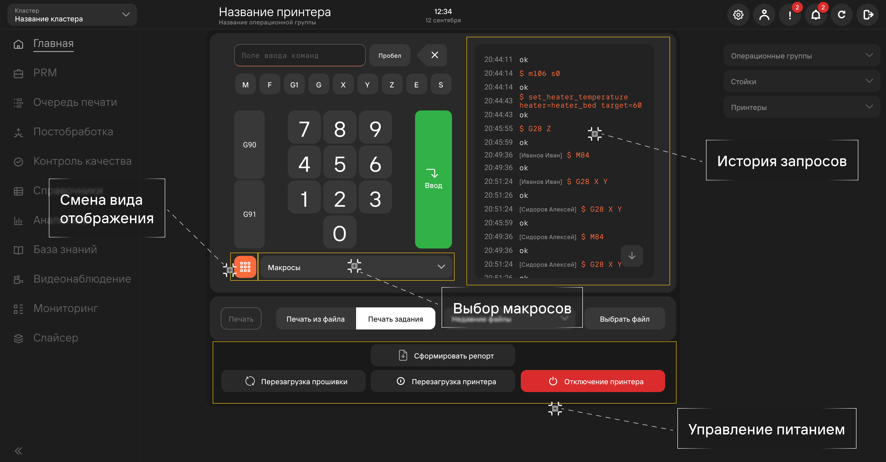

При нажатии на кнопку **Открыть терминал** под областью принтера будет отображено 2 окна терминала.

## Окно 1 

1. **Шаг смещения (разовый)**\
   Настраивает шаг смещения сопла от центра стола в миллиметрах. При запуске печати координаты 
   сопла вернутся на начальную позицию (нулевую точку). Необходимо в ходе сервисного обслуживания\
   для проверки оборудования.
2. **Шаг смещения (постоянный)**\
   В отличии от разового шага смещения:
   - Настраивается только для оси Z;
   - Задается кнопками **Стрелка наверх** и **Стрелка вниз**;
   - При запуске печати не обнуляет настроенное смещение;
   - Необходим для калибровки печати первого слоя.
3. **Текущая позиция**\
   Отображает координаты сопла. Настраиваются с помощью кнопок **Y+**, **X-** и т.д. 
   Кнопка **Home** возвращает координаты в нулевую точку.
4. **Температурные графики**\
   Отображают температуру компонентов принтера с течением времени.
5. **Автокалибровка оборудования**
   - Автокалибровка датчика PROBE\
      Процесс, в ходе которого считается процент неровности стола. При достижении значения, меньшего 
      дельты (допустимой неровности) - принтер начинает печать. Если значение больше дельты - то 
      печать не начнется.
   - Автокалибровка концевика Z\
      Процесс калибровки печатной головы по оси Z. Необходимо для корректного расположения осей 
      печатной головы по плоскостям. Без подобной калибровки печать может начаться в воздухе,\
      что приведет к браку детали.
6. **Настойки разовых операций**
   - Экструзия\
      Выдавливание заданного количества материала из сопла. Может быть необходима при смене 
      материала печати.
   - Ретракт\
      Отход филамента от сопла экструдера. Может быть необходим при перемещении головки или 
      замене материала печати.
   - Протяжка пленки\
      Перемещение ПЭТ-плёнки на заданное расстояние.
7. **Настройка скорости печатной головы экструдирования**
8. **Дополнительный функционал**
   - Включить вакуум
      Активирует [вакуумную систему](https://yt.omegafuture.ru/articles/RedFabMES-A-171) принтера, 
      которая прижимает ПЭТ-плёнку.
   - Калибровка карты стола\
      Запуск процесса калибровки виртуальной модели печатной платформы для автоматического 
      уровнирования перед печатью. Используется для улучшения точности уровнирования и обеспечения 
      более качественной печати.
   - Выравнивание стола\
      Запуск процесса выравнивания печатной платформы для обеспечения равномерного расстояния между 
      соплом и платформой во всех точках печати. Используется для предотвращения дефектов печати, 
      таких как недостаточное прилегание слоев или деформация объекта.
   - Прочистка экструдера\
      Запуск процесса прочистки экструдера от остатков материала для предотвращения засоров\
      и обеспечения правильной экструзии материала. Используется при смене материала или\
      при периодическом техническом обслуживании принтера.
   - Прочистка сопла\
      Запуск процесса прочистки сопла от остатков материала для предотвращения засоров и обеспечения 
      качественной экструзии материала. Используется при смене материала или при периодическом 
      техническом обслуживании принтера.
   - Выключить двигатели\
      Выключение двигателей принтера для предотвращения повреждений или для проведения технического 
      обслуживания. Используется при выполнении работ по обслуживанию принтера\
      или при транспортировке.
   - Охлаждение принтера\
      Выключение всех нагревательных элементов принтера и остановка печати. Используется\
      при перегреве принтера.

## Окно 2 

1. **Поле ввода команд**\
   Содержит само поле и **Numpad** для ввода данных с сенсорных экранов.
2. **Смена отображения окна 2**\
   Нажатие на кнопку открывает историю запросов в полный размер окна, убирая **Numpad**.
3. **История запросов**
4. **Печать фалов вне [очереди печати](/docs/StartWithMES/PrintQueue/)**
5. **Управление питанием принтера**

## Макросы и их назначение 

### Быстрый доступ 

- **RESTART** - повторный запуск печати с начала;
- **FIRMWARE\_RESTART** - перезагрузка прошивки принтера;
- **SAVE\_CONFIG** - сохранение текущих настроек принтера в память;
- **RUN\_SHELL\_COMMAND** - выполнение команды операционной системы из G-кода.;
- **HELLO\_WORLD** - вывод текста "Hello World!" на экран дисплея принтера;
- **RESTART\_MCU** - перезапуск микроконтроллера принтера;
- **PAUSE** - приостановка печати в текущем положении;
- **RESUME** - возобновление печати после паузы;
- **SET\_PAUSE\_NEXT\_LAYER** - установка паузы перед следующим слоем;
- **SET\_PAUSE\_AT\_LAYER** - установка паузы на указанном слое;
- **MOVE\_HEAD\_RELATIVE** - перемещение печатной головы относительно текущего положения;
- **MOVE\_RELEVANT** - перемещение печатной головы в указанное положение;
- **MOVE\_FILAMENT** - перемещение фильеры вперед или назад;
- **T0-T7** - выбор инструмента (T0 - инструмент 1, T1 - инструмент 2 и т.д.);
- **PRINT\_START** - запуск печати;
- **PID\_CALIBRATE** - настройка регулятора PID для нагревателя сопла или печатной платформы;
- **SET\_TEMPERATURE\_FAN\_TARGET** - установка целевой скорости вентилятора охлаждения;
- **QUERY\_ENDSTOPS** - запрос состояния концевых датчиков принтера;
- **MANUAL\_PROBE** - запуск ручного пробивания для калибровки уровня печатной платформы;
- **Z\_ENDSTOP\_CALIBRATE** - настройка концевого датчика оси Z;
- **Z\_OFFSET\_APPLY\_ENDSTOP** - применение смещения оси Z для компенсации высоты сопла 
относительно печатной платформы.

### Ручной ввод 

Система позволяет вводить сторонние (не указанные в быстром доступе) команды.

С подробной информацией о gcode командах можно ознакомиться на следующих ресурсах:

- [Вики по gcode (ru)](https://klipper.wiki/ru/home/prestige/gcode_cmd)
- [Официальная страница Klipper (en)](https://www.klipper3d.org/G-Codes.html)

**Подстатьи**
- [Очередь печати](https://mes-docs.onrender.com/docs/StartWithMES/PrintQueue/)
