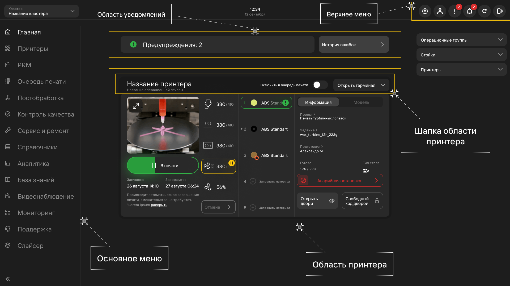
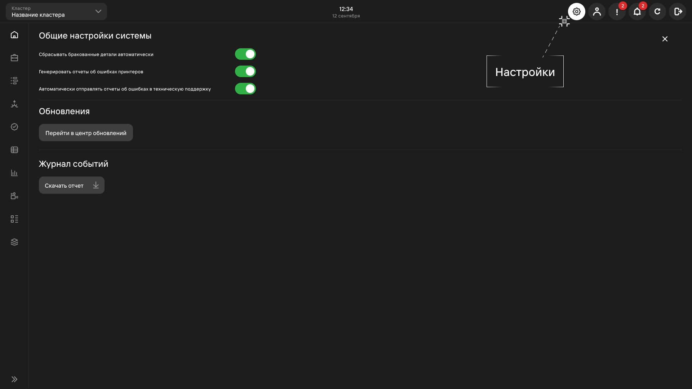
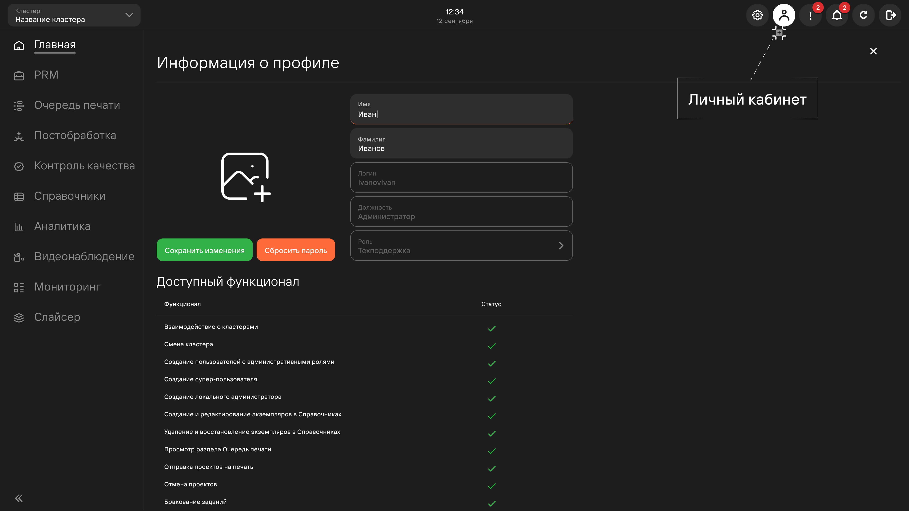
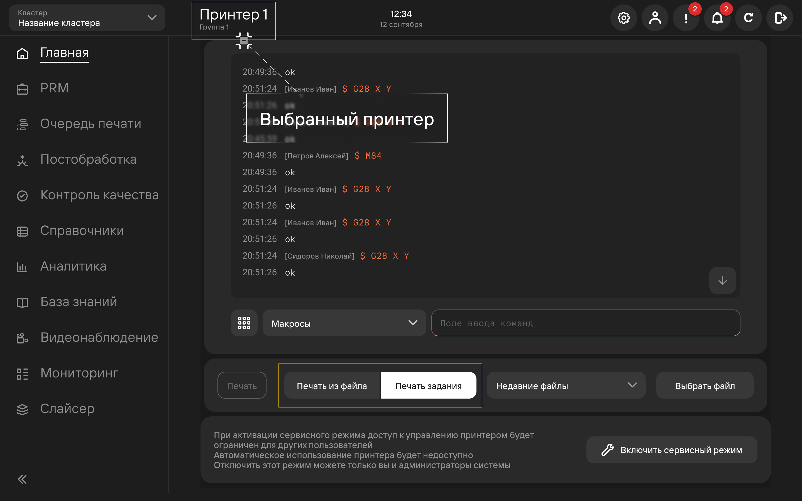

## Авторизация 

Для входа в систему введите пару логин/пароль и нажмите кнопку **Авторизоваться**.

Для просмотра пароля нажмите кнопку **глаз**.

## Главная страница 

После авторизации открывается главная страница, отображающая:

1. Строку меню c переходом в разделы:
   - **Настройки**
   - **Личный кабинет**
   - **Ошибки**\
      Открывает [окно ошибок](https://mes-docs.onrender.com/docs/StartWithMES/NotificationsAndErrors/#ошибки).
   -  **Уведомления**\
      Открывает [окно уведомлений](https://mes-docs.onrender.com/docs/StartWithMES/NotificationsAndErrors/#уведомления).
   -  **Обновить**\
      Выполняет перезагрузку страницы.
   -  **Выйти**\
      Пользователь выходит из системы. Открывается окно регистрации.
2. [**Уведомления и ошибки**](https://mes-docs.onrender.com/docs/StartWithMES/NotificationsAndErrors/)
3. "Шапку" области принтера
   -  Название и операционную группу принтера
   -  Чек-бокс **Включить в очередь печати**\
      Включение чек-бокса помещает принтер в [очередь печати](https://mes-docs.onrender.com/docs/StartWithMES/PrintQueue/PrintQueueRules/). Теперь на него будут назначаться печать копий задач.
   -  [Терминал](https://yt.omegafuture.ru/articles/RedFabMES-A-775)
4. [**Область принтера**](https://mes-docs.onrender.com/docs/StartWithMES/PrinterArea)

## Настройки

- При включении чек-бокса **Сбрасывать бракованные детали автоматически** при браке детали система 
автоматически выполняет отпуск вакуума и протягивание детали, а также начинает новую печать копии;
- При включении чек-бокса **Генерировать отчеты об ошибках принтеров** система автоматически скачивает 
отчеты об ошибках принтера, возникших в ходе работы;
- При включении чек-бокса **Автоматически отправлять отчеты об ошибках в техническую поддержку** система 
автоматически будет отправлять отчет об ошибках специалистам технической поддержки.

Скачивание и отправка отчетов возможна и выборочно, для конкретной ошибки, подробности описаны в 
статье [**Уведомления и ошибки**](https://mes-docs.onrender.com/docs/StartWithMES/NotificationsAndErrors/).

Кнопка **Перейти в Центр обновлений** открывает пользователю 
страницу [центра обновлений](https://mes-docs.onrender.com/docs/StartWithMES/UpdateCenter).

Кнопка **Скачать отчет** в разделе **Журнал событий** скачивает отчет обо всех непрочитанных ошибках и уведомлениях.
Для скачивания отчета о конкретной ошибке необходимо перейти в раздел 
[**история ошибок**](http://localhost:3000/docs/StartWithMES/NotificationsAndErrors/#история-ошибок).

## Личный кабинет 

Для перехода в личный кабинет нажмите кнопку **Личный кабинет**. В личном кабинете доступны 
следующие операции:

1. Смена имени и фамилии
2. Сброс пароля
3. Сохранение введенных изменений
4. Просмотр доступного функционала (зависит от выданной [роли](https://mes-docs.onrender.com/docs/StartWithMES/RoleModel))

При необходимости создания/удаления/редактирования учетных записей - рекомендуется ознакомиться 
с разделом [**Пользователи**](https://mes-docs.onrender.com/docs/WorkingWithReferenceBooks#пользователи).

## Запуск печати 

В MES-системе существует 3 способа запуска печати:

1. Через [**очередь печати**](https://mes-docs.onrender.com/docs/StartWithMES/PrintQueue/)
2. Через [**PRM**](https://mes-docs.onrender.com/docs/PRM)
3. Через [**терминал**](https://mes-docs.onrender.com/docs/StartWithMES/WorkingWithTerminal)
   При печати терез **терминал** копия задания не помещается в очередь печати. Печать через терминал возможна 
   только, если принтер находится [в статусе](https://mes-docs.onrender.com/docs/StartWithMES/PrinterArea#статусы-принтеров) 
   **Готов к работе** и НЕ в очереди печати.\
   Для печати через терминал можно выбрать:
   -  **Печать из файла**\
      Для печати из файла необходимо нажать кнопку **Печать из файла**, а затем **Выбрать файл**. 
      Откроется окно проводника для выбора файла на вашем ПК. Поддерживается только формат gcode.
   -  **Печать задания**

:::caution Внимание
      Будьте осторожны при запуске gcode файлов из неизвестных источников.
      Это может привести к аварии!
:::

**Подстатьи**
- [Уведомления и ошибки](https://mes-docs.onrender.com/docs/StartWithMES/NotificationsAndErrors/)
- [Правила формирования очереди печати](https://mes-docs.onrender.com/docs/StartWithMES/PrintQueue/PrintQueueRules/)
- [Область принтера](https://mes-docs.onrender.com/docs/StartWithMES/PrinterArea)
- [Центр обновлений](https://mes-docs.onrender.com/docs/StartWithMES/UpdateCenter)
- [Ролевая модель](https://mes-docs.onrender.com/docs/StartWithMES/RoleModel)
- [Работа со справочниками](https://mes-docs.onrender.com/docs/WorkingWithReferenceBooks)
- [Очередь печати](https://mes-docs.onrender.com/docs/StartWithMES/PrintQueue/)
- [PRM](https://mes-docs.onrender.com/docs/PRM)
- [Работа с терминалом](https://mes-docs.onrender.com/docs/StartWithMES/WorkingWithTerminal)