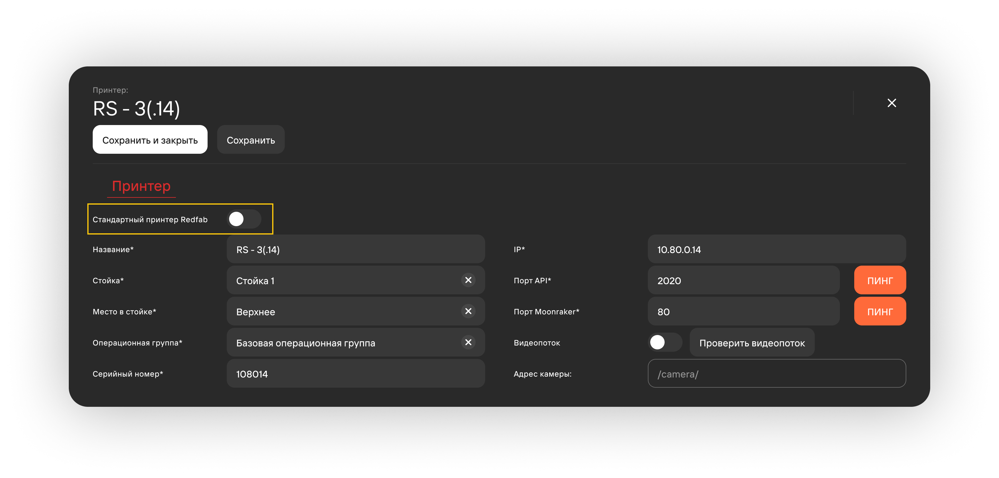

Раздел **Справочники** позволяет пользователям вносить собственные данные о сущностях, используемых\
в их производствах, таких как: принтеры, стойки, материалы, пользователи и прочие.

## Базовый функционал 

- Создание записи (необходим доступ к функционалу **Создание и редактирование экземпляров\
в справочниках**);
  
  

- Открытие карточки записи и ее редактирование (необходим доступ к функционалу **Создание\
и редактирование экземпляров в справочниках**);
- Удаление записи (необходим доступ к функционалу **Удаление и восстановление экземпляров\
в справочниках**);
- Восстановление удаленных записей на вкладке **Показать удаленные** (необходим доступ к функционалу 
**Удаление и восстановление экземпляров в справочниках**).

## Материалы 

- Используются при заполнении карточки задания;
- Используется при загрузке модели в [**слайсер**](/docs/Slicer/) 
для формирования корректного gcode-файла.

## Цвета 

- Используются при заполнении карточки задания;
- Абразивные цвета поддерживают только композитную печать (подробнее в п.1 **Композитные группы**).

## Принтеры 

### Стандартный принтер RedFab 

- Может быть привязан только к стойкам с кнопкой переключения **Стойка RedFab**;
- Мест в стойке RedFab рассчитано максимум на 3 принтера;
- От типа стола зависит характеристика **Вакуумная система** (активна/не активна для редактирования);
- Влияние характеристики **Операционная группа** см в статье: [**Операционные группы**](/docs/StartWithMES/PrintQueue/PrintQueueRules/OperationalGroups);
- Присутствует система селективной подачи;
- При введении в поле **Адрес камеры** URL адреса камеры видеонаблюдения возможен дистанционный
 контроль печати в реальном времени.

### Другие принтеры

- Отсутствуют поля:
  - Тип стола;
  - Вакуумная система;
  - Номер клапана;
  - Система селективной подачи;
- Нет ограничений на количество принтеров в стойке.

## Операционные группы 

- Печать композитами возможна в зависимости от настроек характеристик **Вид сопла** и **Типоразмер**.
 Возможность печати композитами дает возможность использовать *композитные материалы* 
 и *абразивные цвета*;
- Характеристики максимальных координат настраиваются только у нестандартного стола. С включенной
кнопкой переключения поля пропадают, считая размерность стола: 250х400х250;
- В карточке [**операционной группы**](/docs/StartWithMES/PrintQueue/PrintQueueRules/OperationalGroups)
можно привязать существующий принтер.

## Кластеры 

- Кластеры позволяют создать несколько изолированных друг от друга подсистем;
- Используются на главной странице (если отсутствует поле - рекомендуется уменьшить масштаб страницы).

:::tip Пример
      У компании есть 2 филиала в Москве и Питере. Логично - создать для каждого филиала отдельный 
      кластер и ограничить пользователей Москвы от использования принтеров из Петербурга (и наоборот).\
      Для начальства компании уместно открыть доступ к переключению между кластерами, чтобы обеспечить 
      эффективное управление.
:::

## Стойки 

Используется для группировки принтеров и при их создании в справочнике.

Принтеры с кнопкой переключения **Стандартный принтер RedFab** можно привязать только к стойкам с кнопкой переключения
 **Стойка RedFab**.

## Пользователи 

- Логин и пароль вводятся при входе в систему;
- От выданной пользователю роли зависит [**доступный функционал**](/docs/StartWithMES/RoleModel);

- У уже созданных учетных записей при необходимости можно сбрасывать пароль.

## Производители 

Используются при создании материала в справочнике.

## Контрагенты 

- Используются в поле **Клиент** при [**создании проекта**](/docs/StartWithMES/PrintQueue/#проекты);
- При снятии кнопки переключения **Юридическое лицо** поля **Название**, **ИНН**, **КПП** и **Адрес** 
заполнять не нужно.

## Вакуумные системы 

- Используются при создании принтера в справочнике;
- Максимальное кол-во клапанов от одной вакуумной системы - 3 шт.

**Подстатьи**
- [**Работа со слайсером**](https://mes-docs.onrender.com/docs/Slicer/)
- [**Операционные группы**](https://mes-docs.onrender.com/docs/StartWithMES/PrintQueue/PrintQueueRules/OperationalGroups)
- [**Ролевая модель**](https://mes-docs.onrender.com/docs/StartWithMES/RoleModel)
- [**Очередь печати**](https://mes-docs.onrender.com/docs/StartWithMES/PrintQueue/)
