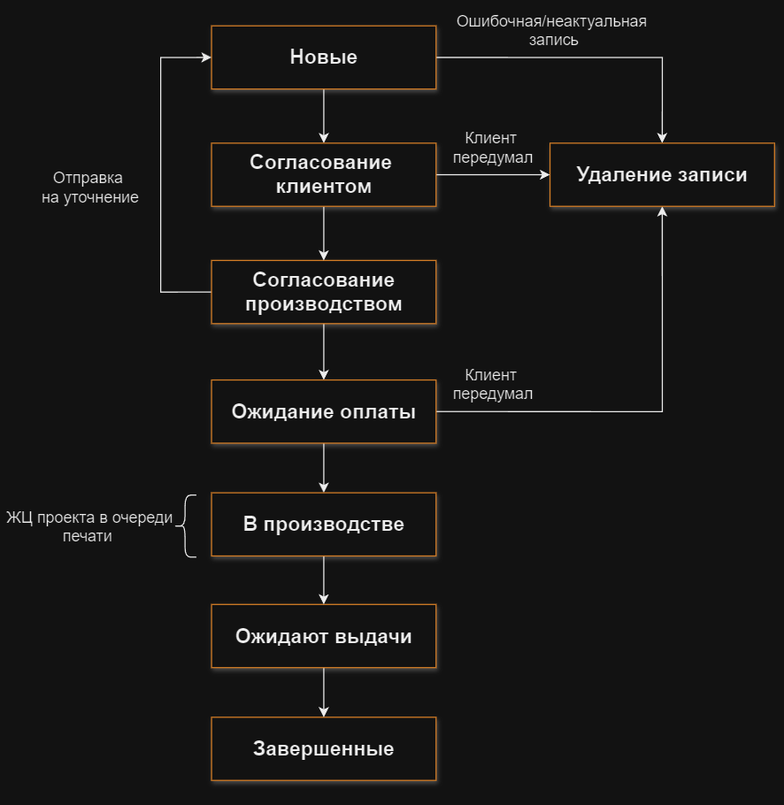
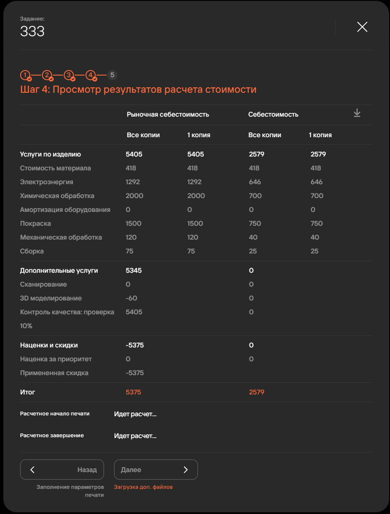
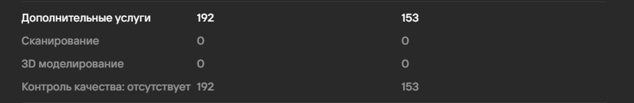
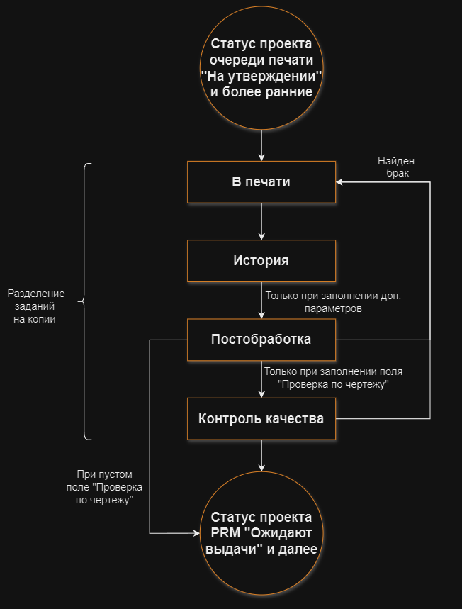

**PRM** (*Partner relationship management*) Система управления взаимоотношениями с партнерами — раздел, 
предназначенный для автоматизации взаимодействия с клиентами. Доступ к разделу имеют пользователи\
в соответствии с их [ролевой моделью](https://yt.omegafuture.ru/articles/RedFabMES-A-774/%D0%A0%D0%BE%D0%BB%D0%B5%D0%B2%D0%B0%D1%8F-%D0%BC%D0%BE%D0%B4%D0%B5%D0%BB%D1%8C). 
Проекты (сделки), созданные через PRM, проходят [расширенный жизненный цикл](https://yt.omegafuture.ru/#%20%D0%A0%D0%B0%D1%81%D1%88%D0%B8%D1%80%D0%B5%D0%BD%D0%BD%D1%8B%D0%B9%20%D0%B6%D0%B8%D0%B7%D0%BD%D0%B5%D0%BD%D0%BD%D1%8B%D0%B9%20%D1%86%D0%B8%D0%BA%D0%BB) 
относительно проектов, созданных через [очередь печати](https://yt.omegafuture.ru/articles/RedFabMES-A-780/%D0%96%D0%B8%D0%B7%D0%BD%D0%B5%D0%BD%D0%BD%D1%8B%D0%B9-%D1%86%D0%B8%D0%BA%D0%BB-%D0%B8-%D1%81%D0%BE%D0%B7%D0%B4%D0%B0%D0%BD%D0%B8%D0%B5-%D0%BF%D1%80%D0%BE%D0%B5%D0%BA%D1%82%D0%B0).

## Расширенный жизненный цикл

1. **Новые**\
   Пользователь с [доступом к функционалу](https://yt.omegafuture.ru/articles/RedFabMES-A-774/%D0%A0%D0%BE%D0%BB%D0%B5%D0%B2%D0%B0%D1%8F-%D0%BC%D0%BE%D0%B4%D0%B5%D0%BB%D1%8C) 
   **Взаимодействие с разделом PRM** создает проект и задания.
2. **Удаление записи**\
   При ошибочном создании проекта/отмены его клиентом пользователь может удалить его.
3. **Согласование клиентом**\
   Этап обсуждения с клиентом стоимости заказа, ожидаемых сроков и прочих деталей.
4. **Согласование производством**\
   Согласование проекта с сотрудником ролью **Начальник производства**.
5. **Ожидание оплаты**\
   Менеджер подтверждает прохождение данного статуса только после получения оплаты от клиента.
6. **В производстве**\
   Данный этап включает в себя весь жизненный цикл проекта, описанный в статье [Жизненный цикл\
   и создание проекта](https://yt.omegafuture.ru/articles/RedFabMES-A-780/%D0%96%D0%B8%D0%B7%D0%BD%D0%B5%D0%BD%D0%BD%D1%8B%D0%B9-%D1%86%D0%B8%D0%BA%D0%BB-%D0%B8-%D1%81%D0%BE%D0%B7%D0%B4%D0%B0%D0%BD%D0%B8%D0%B5-%D0%BF%D1%80%D0%BE%D0%B5%D0%BA%D1%82%D0%B0 "RedFabMES-A-780: Жизненный цикл и создание проекта").
7. **Ожидают выдачи**\
   После завершения печати проекта, и опционального прохождения постобработки и контроля качества, 
   карточка проекта переходит в статус **Ожидают выдачи**. Менеджер подтверждает прохождение 
   данного статуса только после передачи товара клиенту.
8. **Завершенные**\
   Конец расширенного жизненного цикла.

## Расчет стоимости 

При создании задания через PRM менеджер может рассчитать фактическую и рыночную себестоимости задания.

1. **Услуги по изделию**
   - **Стоимость материала**\
      Динамически меняется от параметров: **объем пластика** и **материал**.
   - **Электроэнергия**\
      Динамически меняется от параметра **Расчетное время печати**.
   - **Химическая обработка**\
      Зависит от включенного/выключенного чек-бокса на этапе заполнения доп. параметров. Стоимость фиксированная.
   - **Амортизация оборудования**\
      *У меня не сработало никак*
   - **Покраска**\
      Динамически меняется от параметра **Покраска (все копии)**.
   - **Механическая обработка**\
      Динамически меняется от параметра **Механическая обработка (все копии)**.
   - **Сборка**\
      Динамически меняется от параметра **Сборка (все копии)**.
2. **Дополнительные услуги**
   - **Сканирование**
      Динамически меняется от параметра **Сканирование (все копии)**.\
      *Почему-то не работает (поставил 5 часов), уточнить почему....*

      
      
   - **3D моделирование**\
      Динамически меняется от параметра **Моделирование**.
   - **Контроль качества: проверка**\
      Динамически меняется от вида проверки (10%/вся партия/первая копия) и параметров: 
      **Расчетное время печати**, **Материал**, **Объем пластика**.
3. **Наценки и скидки**
   - **Наценка за приоритет**\
      Зависит от срочности задания. Наценка проставляется только если задача срочная.\
      *Не работает, спросить почему.....*
   - **Примерная скидка**\
      Выставляется менеджером при заполнении доп. параметров задания.

Полученные расчеты можно выгрузить в excel-файл.

## Диаграмма Ганта  

В разработке.

## Постобработка и контроль качества 

При заполнении дополнительных параметров задания жизненный цикл копий задания дополняется двумя новыми стадиями: постобработка и контроль качества.

:::caution Внимание
      Если копия задания из статуса "В печати" была отменена, то ее конечным статусом является **История**.
      На блок-схеме представлен вариант без отмены печати.
:::

1. **Постобработка**
   - При наличии брака копия задания отправляется на статус **В печати**;
   - При отсутствии брака копия задания переходит в раздел **Контроль качества** (если заполнено поле 
   **Проверка по чертежу**).
2. **Контроль качества**
   - Количество записей зависит от параметра **Проверка по чертежу**;
   - При наличии брака копия задания отправляется в статус **В печати**;
   - При отсутствии брака копия задания переходит в статус **Контроль пройден**. Проект\
   в PRM переходит в статус **Ожидают выдачи**.

**Подстатьи**
- [Страница 1](./page1.md)
- [Страница 2](./page2.md)