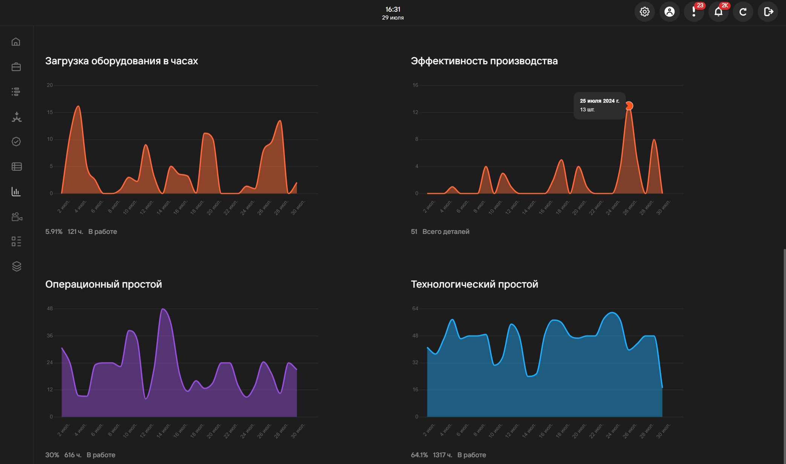

## Мониторинг

Вкладка **Мониторинг** отображает краткую информацию о принтерах в используемом кластере: статус, 
операционная группа, начало и окончание печати и др.

## Видеонаблюдение

Вкладка **Видеонаблюдение** отображает прямую трансляцию подключенных к принтеру видеокамер 
(подключение через [настройки принтера в справочнике](https://yt.omegafuture.ru/articles/RedFabMES-A-790/%D0%A0%D0%B0%D0%B1%D0%BE%D1%82%D0%B0-%D1%81%D0%BE-%D1%81%D0%BF%D1%80%D0%B0%D0%B2%D0%BE%D1%87%D0%BD%D0%B8%D0%BA%D0%B0%D0%BC%D0%B8#%D0%BF%D1%80%D0%B8%D0%BD%D1%82%D0%B5%D1%80%D1%8B)).

При нажатии на кнопку **Расширить** возможен просмотр видео на полном экране.

## Аналитика 
### Общая информация 
Вкладка общей информации отражает краткую информацию по браку, выполненным вовремя заданиям\
и общему времени работы принтеров.

### Загрузка производства 
Вкладка **Загрузка производства** визуализирует данные о загруженности производства за выбранный период.

**Технологический простой** - связан с техническими аспектами оборудования и его работоспособностью.

:::tip Пример
      Оборудование остановилось для замены изношенного двигателя.
:::

**Операционный простой** - связан с организационными и операционными аспектами производственного процесса.

:::tip Пример
      Оборудование остановилось из-за отсутствия необходимых материалов для производства.
:::

### Производительность принтеров 
Вкладка **Производительность принтеров** выводит информацию о загрузке каждого принтера по отдельности за выбранный период времени.

### Работа сотрудников 
Вкладка **Работа сотрудников** информацию о количестве изделий, проектов, задач и браков, выполненных\
за выбранный промежуток времени.

**Подстатьи**
- [Страница 1](./page1.md)
- [Страница 2](./page2.md)