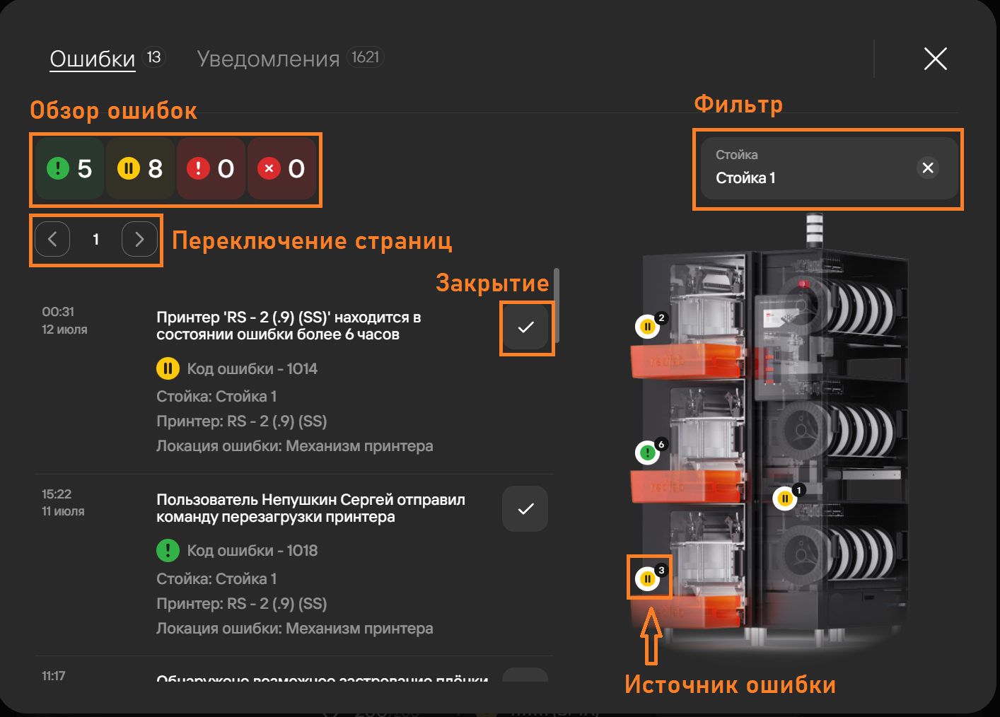
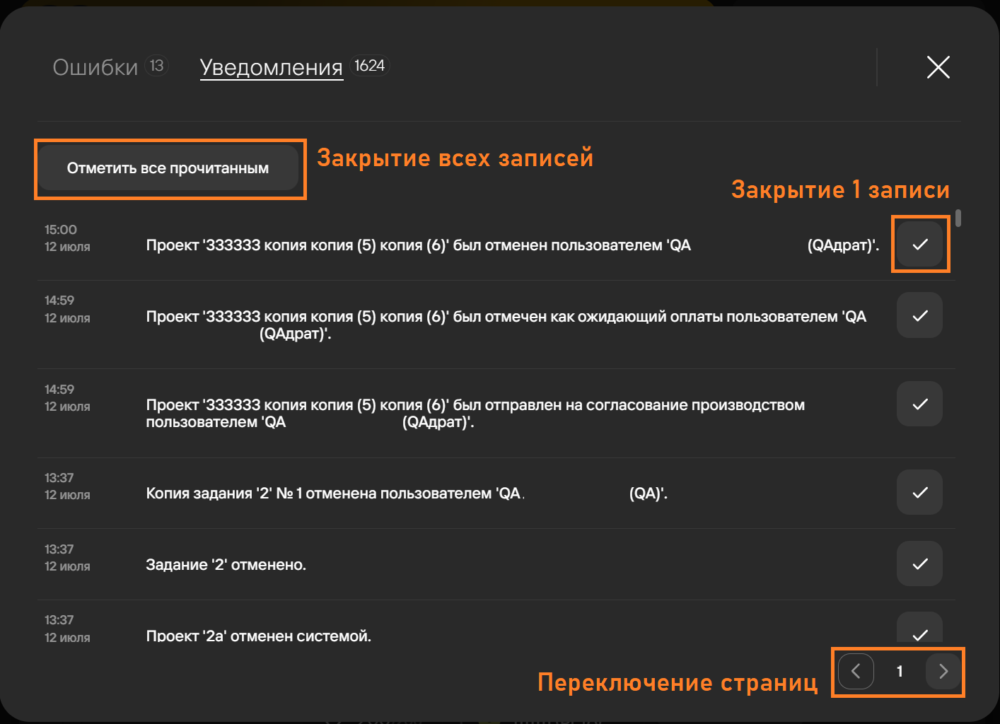
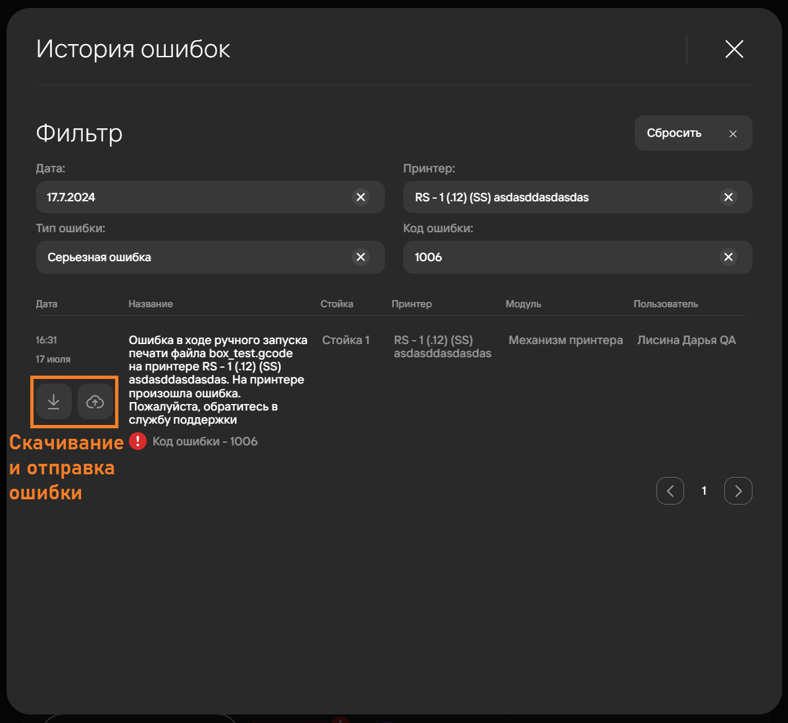
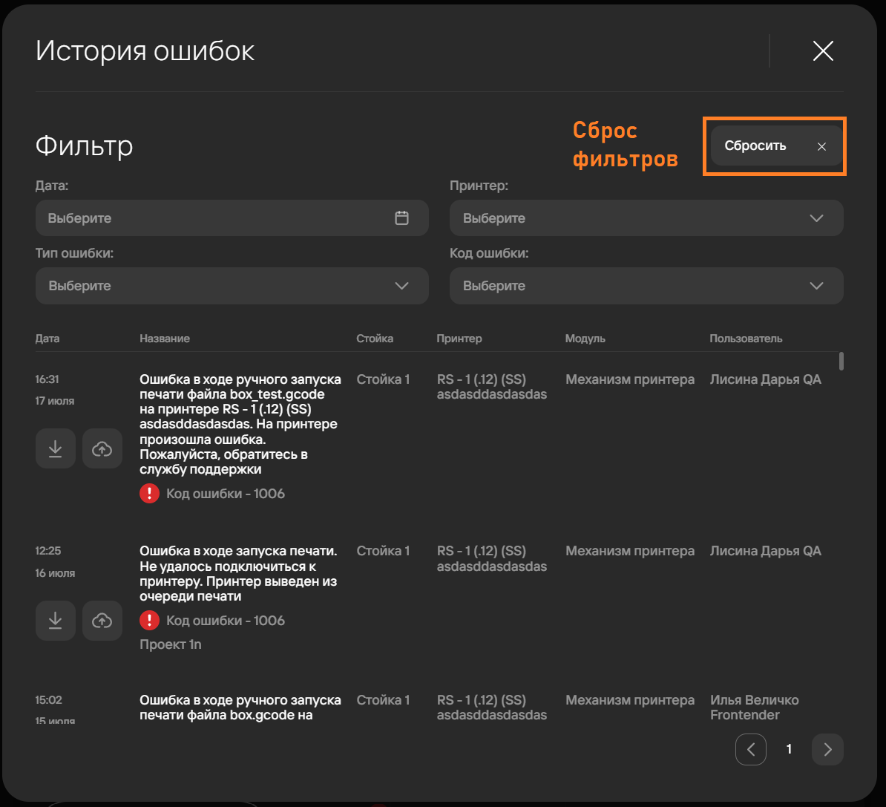

Окно уведомлений и ошибок можно открыть 2 способами:

- Через [пункты меню](https://yt.omegafuture.ru/articles/RedFabMES-A-772/%D0%9D%D0%B0%D1%87%D0%B0%D0%BB%D0%BE-%D1%80%D0%B0%D0%B1%D0%BE%D1%82%D1%8B-%D1%81-MES) 
**Уведомления** и **Ошибки**;
- Через раздел **Уведомления и ошибки** на главной странице системы.

## Ошибки 

Вкладка ошибок содержит следующие элементы:

1. Обзор ошибок по типам:
   - **Оповещение**\
      Ошибка, которая не приводит к [статусу](https://yt.omegafuture.ru/articles/RedFabMES-A-779/%D0%9E%D0%B1%D0%BB%D0%B0%D1%81%D1%82%D1%8C-%D0%BF%D1%80%D0%B8%D0%BD%D1%82%D0%B5%D1%80%D0%B0#%D1%81%D1%82%D0%B0%D1%82%D1%83%D1%81%D1%8B-%D0%BF%D1%80%D0%B8%D0%BD%D1%82%D0%B5%D1%80%D0%BE%D0%B2) 
      **Ошибка**, не приводит к браку детали, и в целом близка\
      по важности к уведомлению.

      :::tip Пример
          Не работает датчик влажности.
      :::

   - **Предупреждение**\
      Ошибка, которая не приводит к [статусу](https://yt.omegafuture.ru/articles/RedFabMES-A-779/%D0%9E%D0%B1%D0%BB%D0%B0%D1%81%D1%82%D1%8C-%D0%BF%D1%80%D0%B8%D0%BD%D1%82%D0%B5%D1%80%D0%B0#%D1%81%D1%82%D0%B0%D1%82%D1%83%D1%81%D1%8B-%D0%BF%D1%80%D0%B8%D0%BD%D1%82%D0%B5%D1%80%D0%BE%D0%B2) 
      **Ошибка**, не приводит к браку детали, но может повлиять\
      на качество печати или время печати.

      :::tip Пример
          Датчик температуры радиатора показывает перегрев, идет охлаждение, подождите.
      :::

   - **Серьезная ошибка**\
      Ошибка, которая приводит к [статусу](https://yt.omegafuture.ru/articles/RedFabMES-A-779/%D0%9E%D0%B1%D0%BB%D0%B0%D1%81%D1%82%D1%8C-%D0%BF%D1%80%D0%B8%D0%BD%D1%82%D0%B5%D1%80%D0%B0#%D1%81%D1%82%D0%B0%D1%82%D1%83%D1%81%D1%8B-%D0%BF%D1%80%D0%B8%D0%BD%D1%82%D0%B5%D1%80%D0%BE%D0%B2) 
      **Ошибка** и может привести к браку детали, если пользователь\
      не сможет быстро устранить 
      причину ошибки.

      :::tip Пример
          Датчик температуры радиатора сломан. Принтер встал на паузу.
      :::

   - **Критическая ошибка**\
      Ошибка, которая приводит к отмене задания и по умолчанию приводит к браку текущей копии задания. 
      Принтер выводится из очереди печати до устранения неисправности.

      :::tip Пример
          Обрыв датчика температуры нагревателя основного экструдера. Текущая копия задания забракована, 
          принтер выведен из очереди печати, очередь проектов пересчитана. Идет охлаждение принтера. 
          Замените датчик температуры согласно инструкции или обратитесь\
          в техническую поддержку.
      :::

2. Фильтр по стойкам
3. Переключение страниц ошибок
4. Кнопка закрытия ошибки
5. Источник ошибки\
   Значок ошибок появляется только при наличии ошибок у определенного источника.

## Уведомления

Вкладка уведомлений отображает информацию о переводе проектов, заданий и их копий в новые статусы\
с указанием автора изменения.

Содержит элементы:

1. Кнопка **Отметить все прочитанным**
2. Кнопка **Закрытие уведомления**
3. **Переключение страниц** уведомлений

Подробнее о статусах проектов смотри в статьях:

- [RedFabMES-A-780: Жизненный цикл и создание проекта](https://yt.omegafuture.ru/articles/RedFabMES-A-780)
- [RedFabMES-A-793: PRM](https://yt.omegafuture.ru/articles/RedFabMES-A-793/PRM)

## История ошибок 

Окно истории ошибок открывается через кнопку **История ошибок** на [главной странице системы](https://yt.omegafuture.ru/articles/RedFabMES-A-772/%D0%9D%D0%B0%D1%87%D0%B0%D0%BB%D0%BE-%D1%80%D0%B0%D0%B1%D0%BE%D1%82%D1%8B-%D1%81-MES).

История ошибок отображает все ошибки, закрытые пользователями.

При необходимости отчет об ошибке можно скачать или отправить администраторам на проверку.

Для удобства поиска в истории ошибок встроен фильтр по следующим параметрам:

- Дата возникновения ошибки;
- Тип ошибки;
- Принтер (источник возникновения);
- Код ошибки.

Кнопка **Сбросить** очищает ранее настроенные фильтры и показывает список всех ошибок в истории.

**Подстатьи**
- [Страница 1](./page1.md)
- [Страница 2](./page2.md)