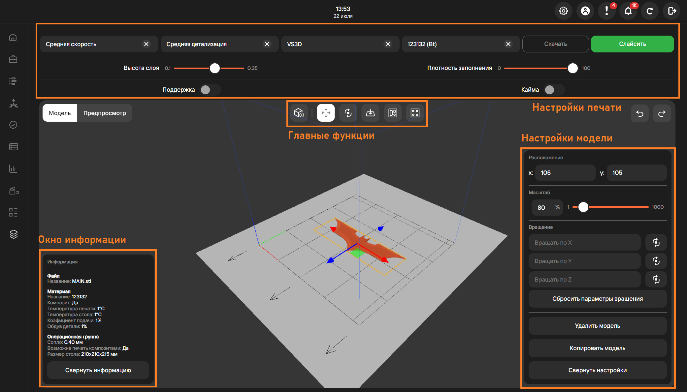

**Слайсер** - это программа, которая преобразует трехмерную модель в набор команд для 3D принтера.\
В MES-системе имеется встроенный слайсер, который позволяет подготовить файл для печати, 
настроив параметры печати, такие как скорость, температура, качество и другие.

Функционал вкладки слайсера разделен на 4 группы:

1. [Главные функции](https://yt.omegafuture.ru/articles/RedFabMES-A-792/%D0%93%D0%BB%D0%B0%D0%B2%D0%BD%D1%8B%D0%B5-%D1%84%D1%83%D0%BD%D0%BA%D1%86%D0%B8%D0%B8-%D1%81%D0%BB%D0%B0%D0%B9%D1%81%D0%B5%D1%80%D0%B0);
2. [Настройки печати](https://yt.omegafuture.ru/articles/RedFabMES-A-800/%D0%9D%D0%B0%D1%81%D1%82%D1%80%D0%BE%D0%B9%D0%BA%D0%B8-%D0%BF%D0%B5%D1%87%D0%B0%D1%82%D0%B8-%D1%81%D0%BB%D0%B0%D0%B9%D1%81%D0%B5%D1%80%D0%B0);
3. Настройки модели;
   Возможный функционал:
   - изменение расположения (координат) модели;
   - изменение масштаба модели;
   - настройка параметра вращения по выбранной оси;
   - сброс параметров вращения;
   - удаление модели;
   - копирование модели.
4. Окно информации.
   Отображает информацию о модели: название, температуру печати, операционную группу и прочее.

**Подстатьи**
- [Страница 1](./page1.md)
- [Страница 2](./page2.md)