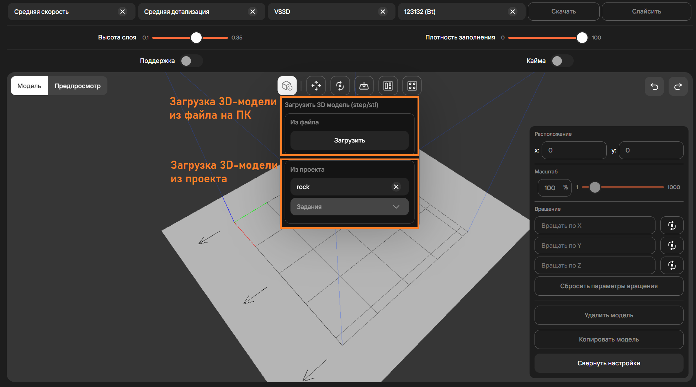
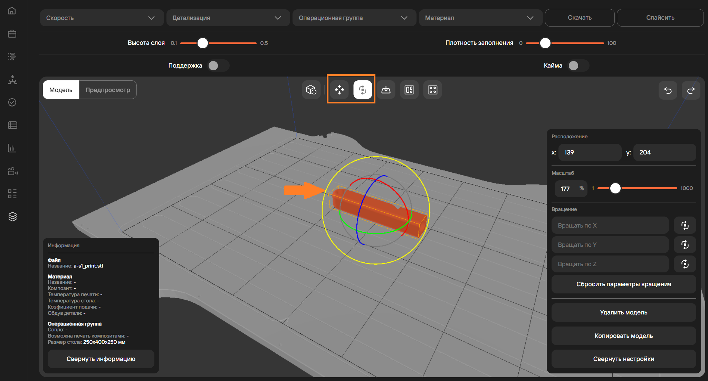
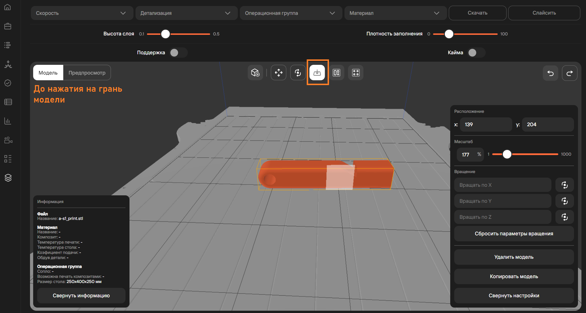
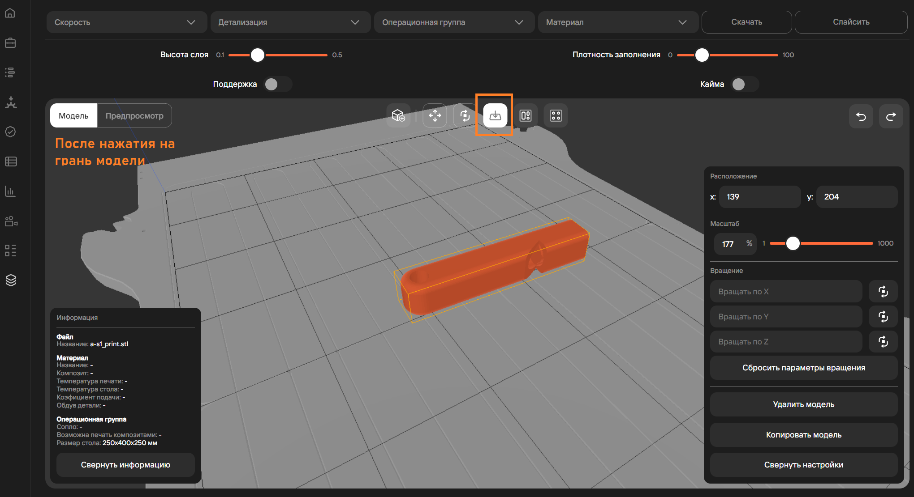
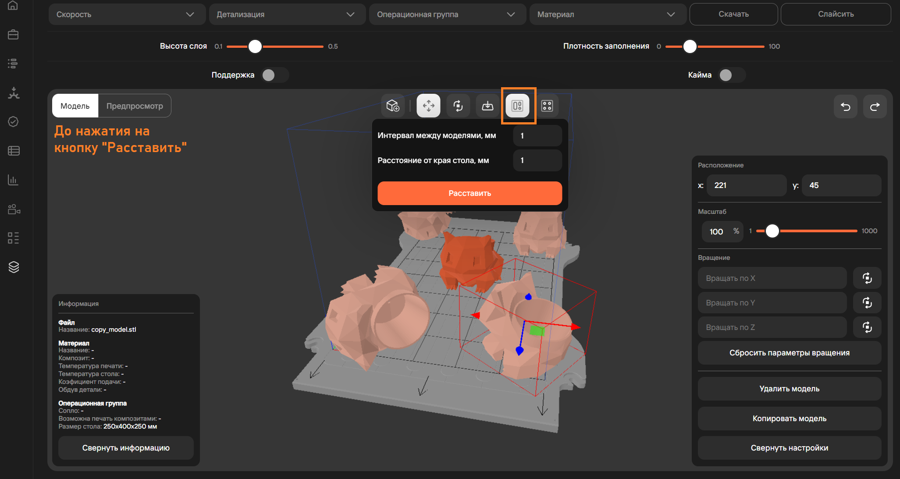
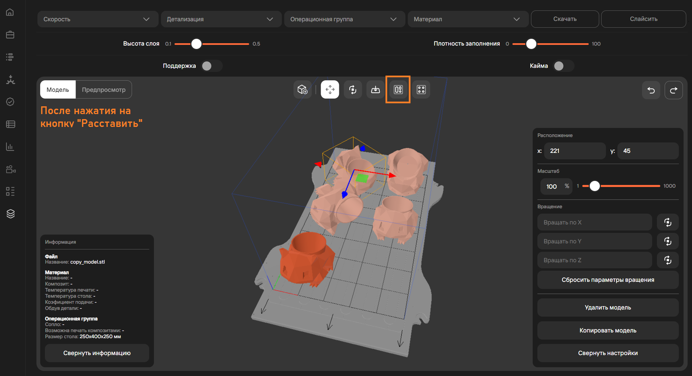
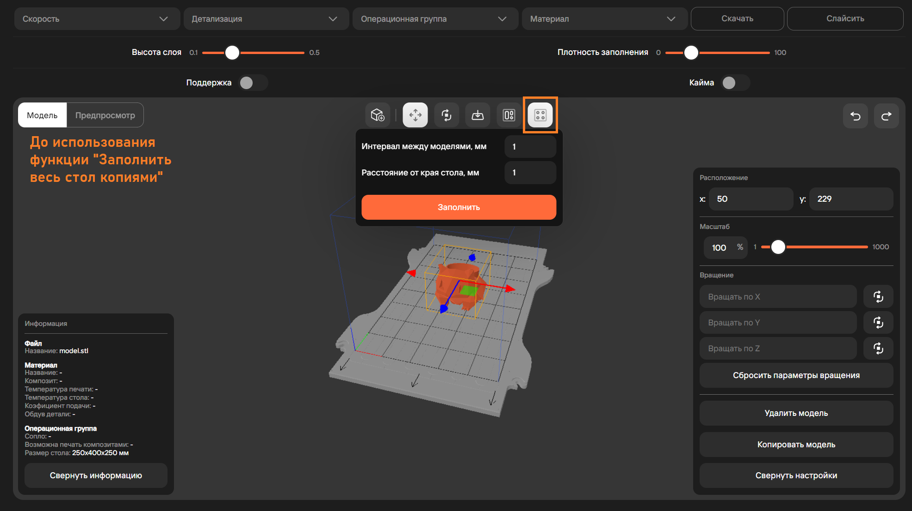
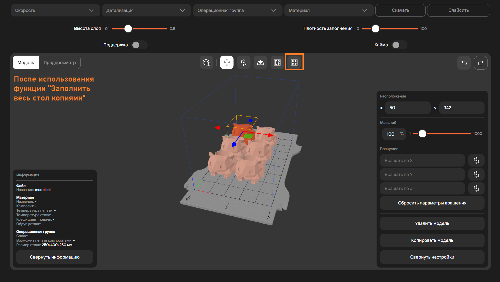

## Добавить модель 

Добавление 3D-модели в слайсер возможна 2-мя способами:

1. Через загрузку 3D-модели с персонального компьютера пользователя;
2. Через импорт 3D-модели из имеющихся проектов в MES-системе.

## Перемещение и вращение 

Отвечают за расположение модели на столе. Для изменения необходимо перемещать модель по выбранной оси.

## Выбрать грань 

Функция **Грань модели** переворачивает модель на выбранную грань.

## Расставить 

Функция **Расставить** позволяет сгруппировать все модели на столе. При запуске функции **Расставить** 
задается минимальный интервал между моделями и краями стола в миллиметрах.

После функции **Расставить** параметры вращения, выставленные у моделей ранее, не изменяются.

## Заполнить весь стол копиями 

Работает аналогично функции **Расставить**, но еще добавляет копии проекта на стол, пока не 
кончается место.

**Подстатьи**
- [Страница 1](./page1.md)
- [Страница 2](./page2.md)